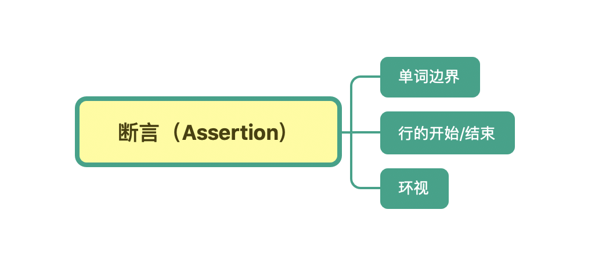
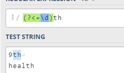
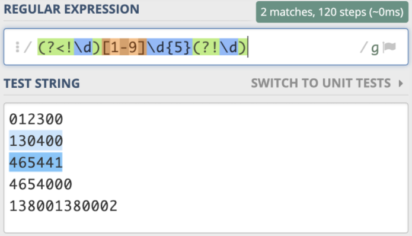
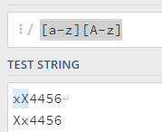
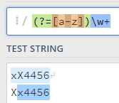
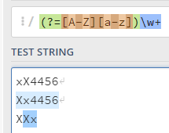
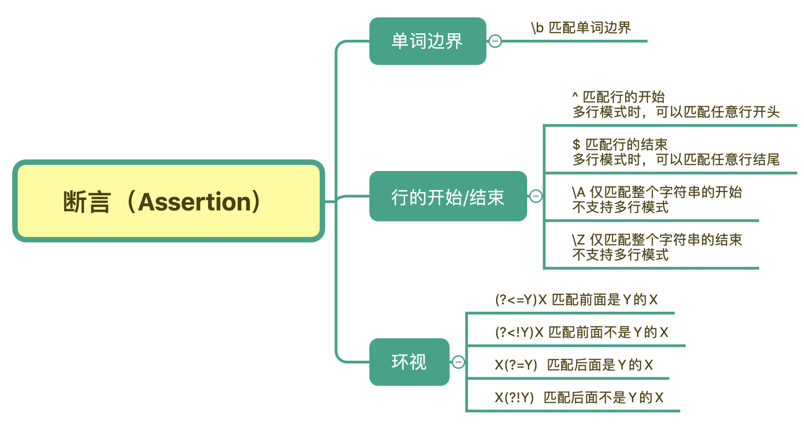
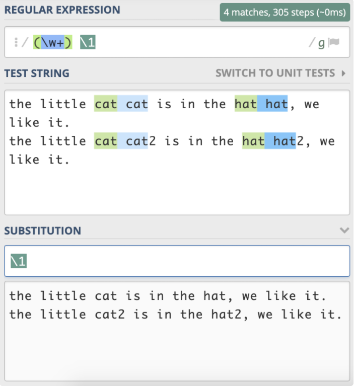
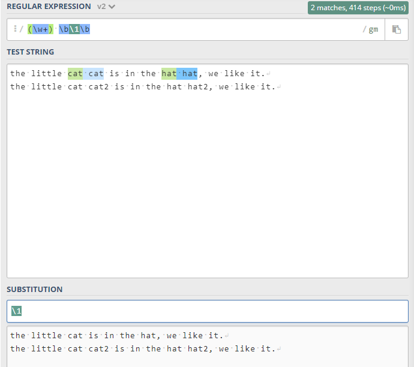
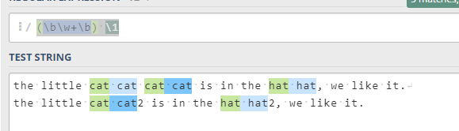

# 05丨断言：如何用断言更好地实现替换重复出现的单词？

今天我来和你聊聊正则断言（Assertion）。

什么是断言呢？简单来说，**断言是指对匹配到的文本位置有要求**。这么说你可能还是没理解，我通过一些例子来给你讲解。你应该知道  `\d{11}`  能匹配上 11 位数字，但这 11 位数字可能是 18 位身份证号中的一部分。再比如，去查找一个单词，我们要查找 tom，但其它的单词，比如 tomorrow 中也包含了 tom。

也就是说，在有些情况下，我们对要匹配的文本的位置也有一定的要求。为了解决这个问题，**正则中提供了一些结构，只用于匹配位置，而不是文本内容本身，这种结构就是断言**。常见的断言有三种：单词边界、行的开始或结束以及环视。



## 单词边界（Word Boundary）

在讲单词边界具体怎么使用前，我们先来看一下例子。

我们想要把下面文本中的 tom 替换成 jerry。注意一下，在文本中出现了 tomorrow 这个单词，**tomorrow 也是以 tom 开头的**。

```
tom asked me if I would go fishing with him tomorrow.
```

中文翻译：Tom 问我明天能否和他一同去钓鱼。

利用前面学到的知识，我们如果直接替换，会出现下面这种结果。

```
替换前：tom asked me if I would go fishing with him tomorrow.
替换后：jerry asked me if I would go fishing with him jerryorrow.
```

这显然是错误的，因为明天这个英语单词里面的 tom 也被替换了。

那正则是如何解决这个问题的呢？单词的组成一般可以用元字符 `\w+` 来表示，`\w` 包括了大小写字母、下划线和数字（即 `[A-Za-z0-9_]`）。那如果我们能找出单词的边界，也就是当出现了  **`\w` 表示的范围以外** 的字符，比如引号、空格、标点、换行等这些符号，我们就可以在正则中使用 `\b` 来表示单词的边界。 `\b`  中的 b 可以理解为是 **边界（Boundary）**这个单词的首字母。


根据刚刚学到的内容，在 **准确匹配单词时**，我们使用  `\b\w+\b`  就可以实现了。

下面我们以 Python3 语言为例子，为你实现上面提到的 `tom 替换成 jerry`：

```python
>>> import re
>>> test_str = "tom asked me if I would go fishing with him tomorrow."
>>> re.sub('\btom\b', 'jerry', test_str)
'tom asked me if I would go fishing with him tomorrow.'
```

## 行的开始或结束

和单词的边界类似，在正则中还有 **文本每行的开始和结束**，如果我们要求匹配的内容要出现在一行文本开头或结尾，就可以使用 `^` 和 `$` 来进行位置界定。

我们先说一下行的结尾是如何判断的。你应该知道换行符号。在计算机中，回车（`\r`）和换行（`\n`）其实是两个概念，并且在不同的平台上，换行的表示也是不一样的。我在这里列出了 Windows、Linux、macOS 平台上换行的表示方式。

|  平台   | 换行符 |
| :-----: | :----: |
| Windows | `\r\n` |
|  Linux  |  `\n`  |
|  macOS  |  `\n`  |

那你可能就会问了，匹配行的开始或结束有什么用呢？

### 日志起始行判断

最常见的例子就是日志收集，我们在收集日志的时候，通常可以指定日志行的开始规则，比如 **以时间开头，那些不是以时间开头的可能就是打印的堆栈信息**。我来给你一个以日期开头，下面每一行都属于同一篇日志的例子。

```

[2020-05-24 12:13:10] "/home/tu/demo.py"
Traceback (most recent call last):
  File "demo.py", line 1, in <module>
    1/0
ZeroDivisionError: integer division or modulo by zero
```

在这种情况下，我们就通过日期时间开头来判断哪一行是日志的第一行，在日期时间后面的日志都属于同一条日志。除非我们看见下一个日期时间的出现，才是下一条日志的开始。

在这里没有示例，`(?s)^\[.+`  使用单行模式下，在点号是贪心模式下，只会匹配到以时间开头的整个文本，相当于只匹配到了一条信息，后续再有时间开头的也会算成这一条信息。

### 输入数据校验

在 Web 服务中，我们常常需要对输入的内容进行校验，比如要求输入 6 位数字，我们可以使用 `\d{6}`  来校验。但你需要注意到，如果用户输入的是 6 位以上的数字呢？在这种情况下，如果不去要求用户录入的 6 位数字必须是行的开头或结尾，就算验证通过了，结果也可能不对。比如下面的示例，在不加行开始和结束符号时，用户输入了 7 位数字，也是能校验通过的：

```python

>>> import re
>>> re.search('\d{6}', "1234567") is not None
True    <-- 能匹配上 (包含6位数字)
>>> re.search('^\d{6}', "1234567") is not None
True    <-- 能匹配上 (以6位数字开头)
>>> re.search('\d{6}$', "1234567") is not None
True    <-- 能匹配上 (以6位数字结尾)
>>> re.search('^\d{6}$', "1234567") is not None
False   <-- 不能匹配上 (只能是6位数字)
>>> re.search('^\d{6}$', "123456") is not None
True    <-- 能匹配上 (只能是6位数字)
```

在前面的匹配模式章节中，我们学习过，在多行模式下，`^` 和 `$` 符号可以匹配每一行的开头或结尾。大部分实现默认不是多行匹配模式，但也有例外，比如 Ruby 中默认是多行模式。所以对于校验输入数据来说，一种更严谨的做法是，使用 `\A` 和 `\z` （Python 中使用 `\Z`） 来匹配整个文本的开头或结尾。

解决这个问题还有一种做法，我们可以在使用正则校验前，先判断一下字符串的长度，如果不满足长度要求，那就不需要再用正则去判断了。相当于你用正则解决主要的问题，而不是所有问题，这也是前面说的使用正则要克制。

## 环视（ Look Around）

《孟子·梁惠王下》中有一个成语「王顾左右而言他」。其中「王顾左右」可以理解成「环视」，看看左边，再看看右边。在正则中我们有时候也需要瞻前顾后，找准定位。**环视就是要求匹配部分的前面或后面要满足（或不满足）某种规则**，有些地方也称环视为 **零宽断言**。

那具体什么时候我们会用到环视呢？我来举个例子。邮政编码的规则是第一位是 1-9，一共有 6 位数字组成。现在要求你写出一个正则，提取文本中的邮政编码。根据规则，我们很容易就可以写出邮编的组成 `[1-9]\d{5}`。我们可以使用下面的文本进行测试：

```
012300  不满足第一位是 1-9
130400  满足要求
465441  满足要求
4654000 长度过长
138001380002 长度过长
```

我们发现，7 位数的前 6 位也能匹配上，12 位数匹配上了两次，这显然是不符合要求的。


正则是通过环视来解决这个问题的。解决这个问题的正则有四种。我给你总结了一个表。

|   正则   |                 名称                 |    含义    |                      示例                       |
| :------: | :----------------------------------: | :--------: | :---------------------------------------------: |
| `(?<=Y)` |  肯定逆序环境<br/>postive-lookahead  |  左边是 Y  |   `(?<=\d)th`  左边是数字的 th，能匹配 `9th`    |
| `(?<!Y)` | 否定逆序环境<br/>negative-lookahead  | 左边不是 Y | `(?<!\d)th`  左边不是数字的 th，能匹配 `health` |
| `(?=Y)`  | 肯定顺序环境<br/>postive-lookbehind  |  右边是 Y  |  `six(?=\d)`  右边是数字的 six，能匹配 `six6`   |
| `(?!Y)`  | 否定顺序环境<br/>negative-lookbehind | 右边不是 Y | `hi(?!\d)`  右边是不是数字的 hi，能匹配 `high`  |

注意上表的示例，能匹配，不表示能匹配这个字符串，是表示这个字符串中的 th 能被匹配，如下图所示



你可能觉得名称比较难记住，没关系，我给你一个小口诀，你只要记住了它的功能和写法就行。这个小口诀你可以在心里默念几遍：**左尖括号代表看左边，没有尖括号是看右边，感叹号是非的意思。**

因此，针对刚刚邮编的问题，就可以写成左边不是数字，右边也不是数字的 6 位数的正则。即 `(?<!\d)[1-9]\d{5}(?!\d)`。这样就能够符合要求了。



注意：这里的 **不是** 是可以用来匹配的文字的，比如:

```
veiuk@email.com.cn;

提取出上面的邮箱，但是不需要 ; 号。
假设这里不要求是一个非常完善的邮箱正则，我们使用：\S+@\S+\.\S+ 来匹配：[任意非空白字符 1 个或多个]@[任意非空白字符 1 个或多个].[任意非空白字符 1 个或多个] 的简单格式
但是你会发现 \S+@\S+\.\S+ 匹配到了这一整行  veiuk@email.com.cn;
这个时候就可以使用右边是 Y 的环视来处理：\S+@\S+\.\S+(?=;)
\S+@\S+\.\S+(?=;) 只会匹配文本：veiuk@email.com.cn
要明白环视只指匹配结构，不匹配文本，所以他的右边是一个 ; 这个是满足的，但是 ; 是环视，所以不是最后匹配的文本结果
```

### 单词边界用环视表示

学习到这里，你可以思考一下，表示单词边界的 `\b` 如果用环视的方式来写，应该是怎么写呢？

这个问题其实比较简单，单词可以用 `\w+` 来表示，单词的边界其实就是那些 不能组成单词的字符，即左边和右边都不能是组成单词的字符。比如下面这句话：

```
the little cat is in the hat
```

the 左侧是行首，右侧是空格，hat 右侧是行尾，左侧是空格，其它单词左右都是空格。所有单词左右都不是 `\w`。

`(?<!\w)`  表示左边不能是单词组成字符，`(?!\w)`  右边不能是单词组成字符，即  `\b\w+\b`  也可以写成 `(?<!\w)\w+(?!\w)`。

另外，根据前面学到的知识，`非 \w`  也可以用 `\W` 来表示。那单词的正则可以写成  `(?<=\W)\w+(?=\W)`。即使用了环视的肯定环境

这个例子是为了让你有更多的思考，并不推荐在日常工作中这么来表示单词的边界，因为 `\b` 明显更简洁，也更容易阅读和书写。

### 环视与子组

友情提醒一下，前面我们在第三讲中讲过「[分组与引用](../02/03.md)」相关的内容，如果忘记了可以回去复习复习。**环视中虽然也有括号，但不会保存成子组**。保存成子组的一般是匹配到的文本内容，后续用于替换等操作，而环视是表示对文本左右环境的要求，即环视只匹配位置，不匹配文本内容。你也可以总结一下，圆括号在正则中都有哪些用途，不断地去复习学过的内容，巩固自己的记忆。

## 环视拓展例子

### 必须包含大小写字母

如下的正则表达式，含义是：必须出现 大小写字母、数字、特殊字符，  6-16 个字符

```
(?=.*?[a-z])(?=.*?[A-Z])(?=.*?\d)(?=.*?[#@*&.])[\w!@#$%^&*._]{6,16}
```

我们拆解来看，就会发现其中的玄妙在于环视的利用上

```
(?=.*?[a-z])
(?=.*?[A-Z])
(?=.*?\d)
(?=.*?[#@*&.])
[\w!@#$%^&*._]{6,16}
```

前 4 组使用了环视，并且都使用了 **肯定顺序环境**，即右边必须是 xx，后面一组限定了 6-16 个字符中能出现的字符

那么也就是说，**前 4 组限定右侧的 6-16 个字符中必须要出现的字符有哪些**。

那么重点就是这个环视了：不好理解的右侧限定的内容，即 `.*?[a-z]`

- ``.*` ：任意字符出现 0 次或多次

- `?`：给这个量词 `*` 限定为非贪婪匹配模式

  与不加该问号，即贪婪匹配模式的区别，在这里应该仅仅只是少匹配几次，增加了匹配性能

- `[a-z]` ：那么唯一看不太懂的就是这个后面的可选字符了

在正常的正则中这样写，表示必须按照顺序出现，如下面这样



那么加上环视如下，也是按顺序比如要第一个出现的



这个时候我们离真相进了一步，再来看看下面这个例子，**限定右侧需要先出现一个大写字母然后出现一个小写字母**



那么我们马上就接近真相了，再来看看下面这个例子：**给第一个大写字母增加了一个量词** ，0 次或则多次，这里默认是贪婪匹配模式，**但是还是会匹配到 0 次，所以第一行小写字母会被匹配上**


那么再来看看这个完整的例子

```
(?=.*?[a-z])
(?=.*?[A-Z])
(?=.*?\d)
(?=.*?[#@*&.])
[\w!@#$%^&*._]{6,16}
```

我们会发现一个问题，环视可以多次使用，但是他们不像单个字符那样是有顺序要求的，另外这里使用了 `.*` 任意字符，那么无论对于贪婪匹配还是非贪婪匹配都会去尽量满足条件，只是非贪婪匹配在该例子中性能会更高一点

## 总结

今天我们学习了正则中断言相关的内容，最常见的断言有三种：单词的边界、行的开始或结束、环视。

单词的边界是使用 `\b` 来表示，这个比较简单。而多行模式下，每一行的开始和结束是使用  `^` 和 `$` 符号。如果想匹配整个字符串的开始或结束，可以使用 `\A` 和 `\z`，它们不受匹配模式的影响。

最后就是环视，它又分为四种情况：肯定逆向环视、否定逆向环视、肯定顺序环视、否定顺序环视。在使用的时候记住一个方法：**有左尖括号代表看左边，没有尖括号是看右边，而感叹号是非的意思。**



## 课后思考

最后，我们来做一个小练习吧。前面我们用正则分组引用来实现替换重复出现的单词，其实之前写的正则是不严谨的，在一些场景下，其实是不能正常工作的，你能使用今天学到的知识来完善一下它么？

```
the little cat cat2 is in the hat hat2, we like it.
```

需要注意一下，**文本中 cat 和 cat2，还有 hat 和 hat2 其实是不同的单词**。你应该能想到在 `\w+` 左右加上单词边界 `\b` 来解决这个问题。你可以试一下，真的能像期望的那样工作么？也就是说，在分组引用时，前面的断言还有效么？



答案为：`(\w+) \b\1\b`



测试文本为：

```
the little cat cat is in the hat hat, we like it.
the little cat cat2 is in the hat hat2, we like it.
```

下面是其他的写法：

- `(\w+) \b\1\b` 这个只能处理测试文本中出现了 2 次的单词，可以看到边界可以拼接到引用前后9

- `(\w+)\s+(\b\1\b\s*)+`  可以做到无论重复多少次的单词，都可以只保留一个单词，还兼容了单词间可能有多个空格的情况、也兼容换行时的重复

- `(\b\w+\b) \1`：分组里面使用单词边界后，引用时会失效

  

此题主要用意是：告诉你 **引用** 时，如果引用的是一个带有断言的匹配，那么这个断言在引用中不会生效，只是把匹配的值带过去了
