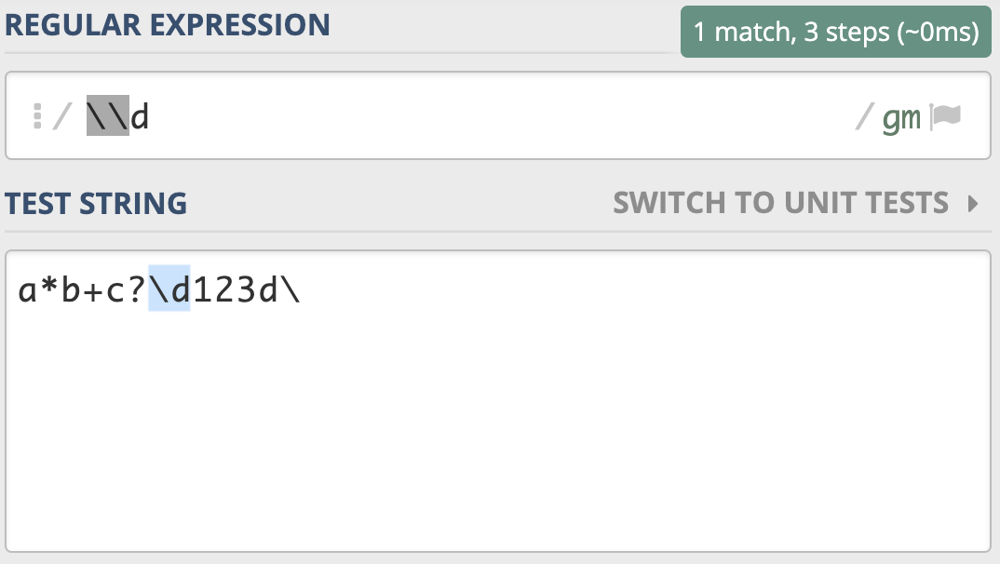
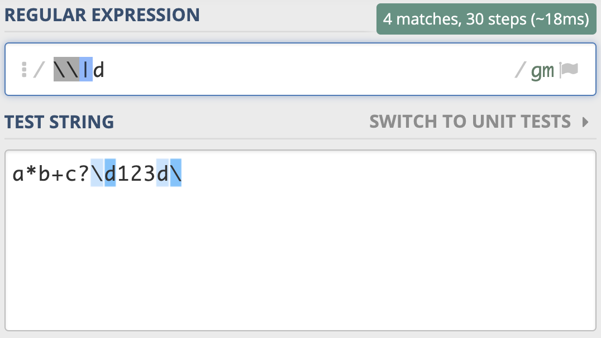
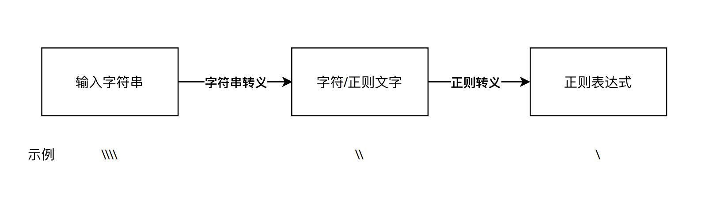
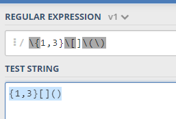

# 06丨转义：正则中转义需要注意哪些问题？

转义对我们来说都不算陌生，编程的时候，使用到字符串时，双引号里面如果再出现双引号，我们就可以通过转义来解决。就像下面这样：

```java
str = "How do you spell the word \"regex\"?"
```

虽然转义在日常工作中比较常见，但正则中什么时候需要转义，什么时候不用转义，在真正使用的时候可能会遇到这些麻烦。所以我们很有必要来系统了解一下正则中的转义。

## 转义字符

首先我们说一下什么是 **转义字符（Escape Character）**。它在维基百科中是这么解释的：

> 在计算机科学与远程通信中，当转义字符放在字符序列中，它将对它后续的几个字符进行替代并解释。通常，判定某字符是否为转义字符由上下文确定。转义字符即标志着转义序列开始的那个字符。

这么说可能有点不好理解，我再来给你通俗地解释一下。转义序列通常有两种功能。第一种功能是编码无法用字母表直接表示的特殊数据。第二种功能是用于表示无法直接键盘录入的字符（如回车符）。

我们这节课说的就是第二种情况，转义字符自身和后面的字符看成一个整体，用来表示某种含义。最常见的例子是，C 语言中用反斜线字符 `\` 作为转义字符，来表示那些不可打印的 ASCII 控制符。另外，在 URI 协议中，请求串中的一些符号有特殊含义，也需要转义，转义字符用的是百分号 `%`。之所以把这个字符称为 **转义字符**，是因为它后面的字符，不是原来的意思了。

在日常工作中经常会遇到转义字符，比如我们在 shell 中删除文件，如果文件名中有 `*` 号，我们就需要转义，此时我们能看出，使用了转义字符后，`*` 号就能放进文件名里了。

```
rm access_log*    # 删除当前目录下 access_log 开头的文件
rm access_log\*   # 删除当前目录下名字叫 access_log* 的文件
```

再比如我们在双引号中又出现了双引号，这时候就需要转义了，转义之后才能正常表示双引号，否则会报语法错误。比如下面的示例，引号中的 Hello World! 也是含有引号的。

```
print "tom said \"Hello World!\" to the crowd."
```

下面是一些常见的转义字符以及它们的含义。

| 转移字符 | 意义                                   | ASCII 码值（十进制） |
| :------: | :------------------------------------- | :------------------: |
|   `\n`   | 换行符（LF），将当前位置移到下一行开头 |         010          |
|   `\r`   | 回车（CR），将当前位置移到本行开头     |         013          |
|   `\t`   | 水平制表（HT）(跳到下一个 TAB 位置)    |         009          |
|   `\v`   | 垂直制表（VT）                         |         011          |
|   `\\`   | 代表一个反斜线字符 `\`                 |         092          |
|   `\'`   | 代表一个单引号字符                     |         039          |
|   `\"`   | 代表一个双引号字符                     |         034          |

## 字符串转义和正则转义

我们再来看一下正则中的转义。正则中也是使用 **反斜杠进行转义的**。

一般来说，正则中 `\d` 代表的是单个数字，但如果我们想表示成 反斜杠和字母 d，这时候就需要进行转义，写成  `\d`，这个就表示反斜杠后面紧跟着一个字母 d。



刚刚的反斜杠和 d 是连续出现的两个字符，如果你想表示成反斜杠或 d，可以用管道符号或中括号来实现，比如 `\|d`  或  `[\d]`。



需要注意的是，如果你想用代码来测试这个，在程序中表示普通字符串的时候，我们如果要表示反斜杠，通常需要写成两个反斜杠，**因为只写一个会被理解成「转义符号」，而不是反斜杠本身**。

下面我给出使用 Python3 来测试的情况，你可以看一下。

```python

>>> import re
>>> re.findall('\\|d', 'a*b+c?\d123d\')  # 字符串没转义"反斜杠"
  File "<input>", line 1
      re.findall('\\|d', 'a*b+c?\d123d\')
                                       ^
SyntaxError: EOL while scanning string literal
>>> re.findall('\\|d', 'a*b+c?\\d123d\\')
[]
```

看到这里，你内心是不是有很多问号？为什么转义了还不行呢？我们来把正则表达式部分精简一下，看看两个反斜杠在正则中是什么意思。

```python
>>> import re
>>> re.findall('\\', 'a*b+c?\\d123d\\')
Traceback (most recent call last):
 省去部分信息
re.error: bad escape (end of pattern) at position 0
```

我们发现，正则部分写的两个反斜杠，Python3 处理的时候会报错，**认为是转义字符，即认为是单个反斜杠**，如果你再进一步测试在正则中写单个反斜杠，你会发现直接报语法错误，你可以自行尝试。

那如何在正则中正确表示反斜杠呢？答案是写四个反斜杠。

```python
>>> import re
>>> re.findall('\\\\', 'a*b+c?\\d123d\\')
['\\', '\\']
```

你可以想一下，为什么不是三个呢？后面的文本部分，也得要用四个反斜杠表示才是正确的么？到这里，你是不是发现，转义其实没那么简单。

我来给你详细解释一下这里面的过程，在程序使用过程中，**从输入的字符串到正则表达式**，其实有两步转换过程，分别是 **字符串转义** 和 **正则转义**。

在正则中正确表示 **反斜杠** 具体的过程是这样子：我们输入的字符串，四个反斜杠 `\`，经过第一步字符串转义，它代表的含义是 **两个反斜杠 `\` **；这两个反斜杠再经过第二步 **正则转义**，它就可以代表单个反斜杠 `\` 了。



你可以用这个过程，推导一下两个和三个反斜杠的转换过程，这样你就会明白上面报错的原因了。

那在真正使用的时候，有没有更简单的方法呢？答案是有的，我们尽量使用原生字符串，在 Python 中，可以在正则前面加上小写字母 r 来表示。

```python
>>> import re
>>> re.findall(r'\\', 'a*b+c?\\d123d\\')
['\\', '\\']
```

这样看起来就简单很多，因为少了上面说的第一次转换。

## 正则中元字符的转义

在前面的内容中，我们讲了很多元字符，相信你一定都还记得。如果现在我们要查找比如星号（`*`）、加号（`+`）、问号（`?`）本身，而不是元字符的功能，这时候就需要对其进行转义，直接在前面加上反斜杠就可以了。这个转义就比较简单了，下面是一个示例。

```python
>>> import re
>>> re.findall('\+', '+')
['+']
```

## 括号的转义

在正则中方括号 `[]` 和花括号 `{}` 只需转义开括号，但圆括号 `()` 两个都要转义。我在下面给了你一个比较详细的例子。

```python
>>> import re
>>> re.findall('\(\)\[]\{}', '()[]{}')
['()[]{}']
>>> re.findall('\(\)\[\]\{\}', '()[]{}')  # 方括号和花括号都转义也可以
['()[]{}']
```

在正则中，**圆括号通常用于分组**，或者将某个部分看成一个整体，如果只转义开括号或闭括号，正则会认为少了另外一半，所以会报错。



这里有一个例子：https://regex101.com/r/kJfvd6/1
