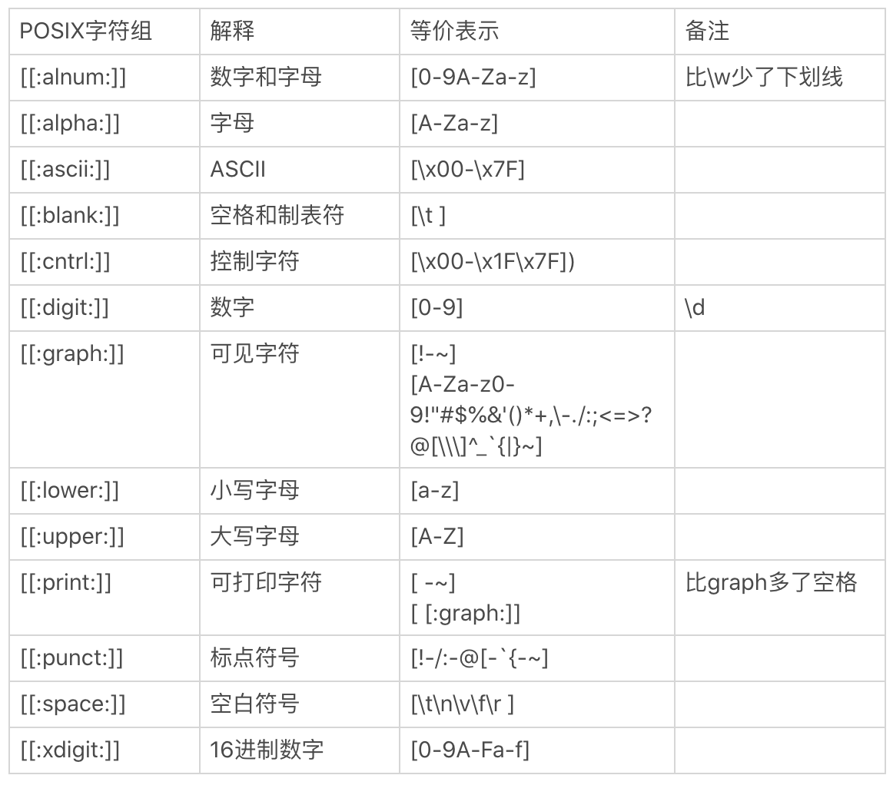
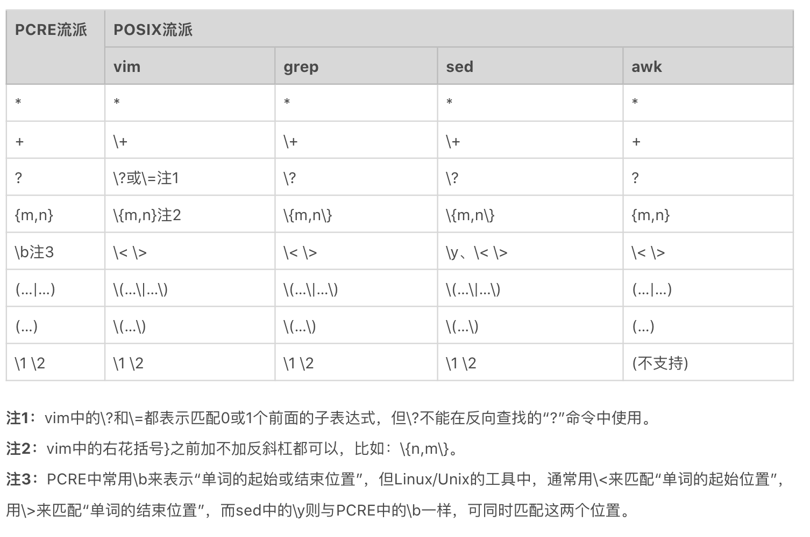
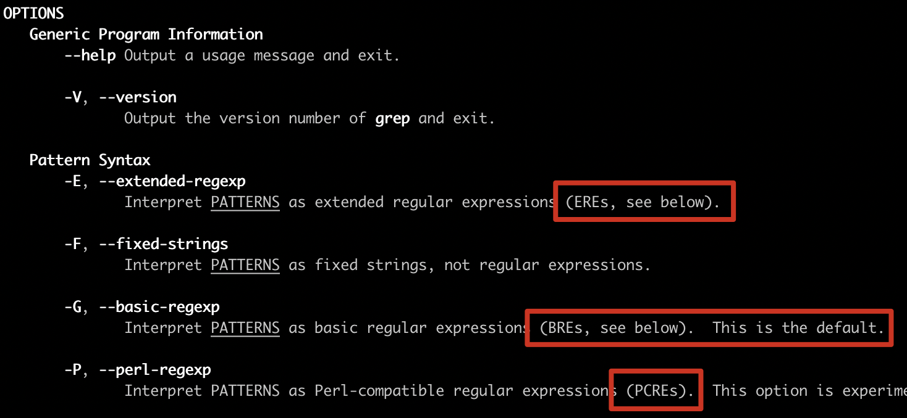
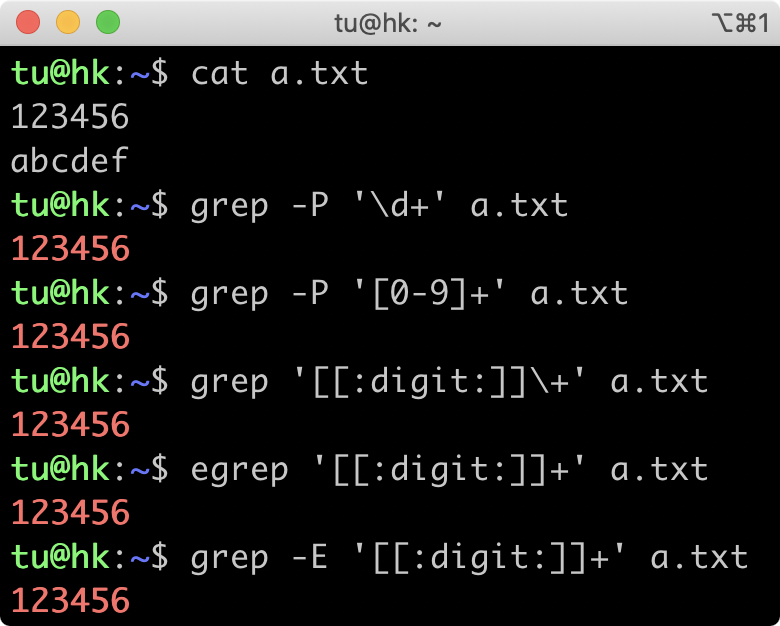

# 07丨正则有哪些常见的流派及其特性？

今天我来给你讲讲正则常见的流派及其特性。

你可能要问了，讲正则流派有啥用呢？不如多来点实战啊。其实，我们去了解正则的演变过程是很有必要的。因为你一旦了解了正则的演变过程之后，就能够更加正确地去使用正则，尤其是在 Linux 系统中。

那我们就先来看一个有关 Linux 系统的例子，你先来感受一下。

如果你在 Linux 系统的一些命令行中使用正则，比如使用 grep 过滤内容的时候，你可能会发现结果非常诡异，就像下图这样，在 grep 命令中，使用正则 `\d+` 取不到数据，甚至在 `egrep` 中输出了英文字母 d 那一行。


这个执行结果的原因就和正则的演变有着密不可分的关系。那到底有什么样的关系呢？我们接着往下看，我从正则的发展历史给你讲起。

## 正则表达式简史

正则表达式的起源，可以追溯到，早期神经系统如何工作的研究。在 20 世纪 40 年代，有两位神经生理学家（Warren  McCulloch 和 Walter Pitts），研究出了一种用数学方式来描述神经网络的方法。

1956 年，一位数学家（Stephen Kleene）发表了一篇标题为《神经网络事件表示法和有穷自动机》的论文。这篇论文描述了一种叫做「正则集合（Regular Sets）」的符号。

随后，大名鼎鼎的 Unix 之父 Ken Thompson 于 1968 年发表了文章《正则表达式搜索算法》，并且将正则引入了自己开发的编辑器 qed，以及之后的编辑器 ed 中，然后又移植到了大名鼎鼎的文本搜索工具 grep 中。自此，正则表达式被广泛应用到 Unix 系统或类 Unix 系统 (如 macOS、Linux) 的各种工具中。

随后，由于正则功能强大，非常实用，越来越多的语言和工具都开始支持正则。不过遗憾的是，由于没有尽早确立标准，导致各种语言和工具中的正则虽然功能大致类似，但仍然有不少细微差别。

于是，诞生于 1986 年的 POSIX 开始进行标准化的尝试。POSIX 作为一系列规范，定义了 Unix 操作系统应当支持的功能，其中也包括正则表达式的规范。因此，Unix 系统或类 Unix 系统上的大部分工具，如 grep、sed、awk 等，均遵循该标准。我们把这些遵循 POSIX 正则表达式规范的正则表达式，称为 **POSIX 流派** 的正则表达式。

在 1987 年 12 月，Larry Wall 发布了 Perl 语言第一版，因其功能强大一票走红，所引入的正则表达式功能大放异彩。之后 Perl 语言中的正则表达式不断改进，影响越来越大。于是在此基础上，1997 年又诞生了 PCRE——**Perl 兼容正则表达式**（Perl Compatible Regular Expressions）。

PCRE 是一个兼容 Perl 语言正则表达式的解析引擎，是由 Philip Hazel 开发的，为很多现代语言和工具所普遍使用。除了 Unix 上的工具遵循 POSIX 标准，PCRE 现已成为其他大部分语言和工具隐然遵循的标准。

之后，正则表达式在各种计算机语言或各种应用领域得到了更为广泛的应用和发展。**POSIX 流派** 与 **PCRE 流派** 是目前正则表达式流派中的两大最主要的流派。

## 正则表达式流派

就像前面说的一样，目前正则表达式主要有两大流派（Flavor）：POSIX 流派与 PCRE 流派。下面我们分别来看看。

## 1. POSIX 流派

这里我们先简要介绍一下 POSIX 流派。POSIX 规范定义了正则表达式的两种标准：

- **BRE 标准**（Basic Regular Expression 基本正则表达式）；

- **ERE 标准**（Extended Regular Expression 扩展正则表达式）。

接下来，我们一起来看一下这两种标准的异同点。

### BRE 标准 和 ERE 标准

早期 BRE 与 ERE 标准的区别主要在于，**BRE 标准不支持量词问号和加号，也不支持多选分支结构管道符**。BRE 标准在使用花括号，圆括号时要转义才能表示特殊含义。BRE 标准用起来这么不爽，于是有了 ERE 标准，在使用花括号，圆括号时不需要转义了，还支持了问号、加号 和 多选分支。

我们现在使用的 Linux 发行版，大多都集成了 GNU 套件。GNU 在实现 POSIX 标准时，做了一定的扩展，主要有以下三点扩展。

1. GNU BRE 支持了 `+、?`，但转义了才表示特殊含义，即需要用  `\+、\?` 表示。

2. GNU BRE 支持管道符多选分支结构，同样需要转义，即用 `\|` 表示。

3. GNU ERE 也支持使用反引用，和 BRE 一样，使用 `\1、\2…\9`  表示。

BRE 标准和 ERE 标准的详细区别，我给了你一个参考图，你可以看一下，浅黄色背景是 BRE 和 ERE 不同的地方，三处天蓝色字体是 GNU 扩展。


总之，GNU BRE 和 GNU ERE 它们的功能特性并没有太大区别，区别是在于部分语法层面上，主要是一些字符要不要转义。

### POSIX 字符组

POSIX 流派还有一个特殊的地方，就是有自己的字符组，叫 POSIX 字符组。这个类似于我们之前学习的  `\d`  表示数字，`\s`  表示空白符等，POSIX 中也定义了一系列的字符组。具体的清单和解释如下所示：



## 2. PCRE 流派

除了 POSIX 标准外，还有一个 Perl 分支，也就是我们现在熟知的 PCRE。随着 Perl 语言的发展，Perl 语言中的正则表达式功能越来越强悍，为了把 Perl 语言中正则的功能移植到其他语言中，PCRE 就诞生了。

目前大部分常用编程语言都是源于 PCRE 标准，这个流派显著特征是有 `\d`、`\w`、`\s` 这类字符组简记方式。

不过，虽然 PCRE 流派是从 Perl 语言中衍生出来的，但与 Perl 语言中的正则表达式在语法上还是有一些细微差异，感兴趣的可以去看看 PHP 的 preg 正则表达式 (Perl Regular Expression) 与 Perl 正则表达式的差异

考虑到目前绝大部分常用编程语言所采用的正则引擎，基本都属于 PCRE 流派的现实情况，我们的课程也是主要讲解 PCRE 流派。前面，对于正则表达式语法元素的解释都是以 PCRE 流派为准。

### PCRE 流派的兼容问题

虽然 PCRE 流派是与 Perl 正则表达式相兼容的流派，但这种兼容在各种语言和工具中还存在程度上的差别，这包括了 **直接兼容** 与 **间接兼容** 两种情况。

而且，即便是直接兼容，也并非完全兼容，还是存在部分不兼容的情况。原因也很简单，Perl 语言中的正则表达式在不断改进和升级之中，其他语言和工具不可能完全做到实时跟进与更新。

- **直接兼容**，PCRE 流派中与 Perl 正则表达式直接兼容的语言或工具。比如 Perl、PHP  preg、PCRE 库等，一般称之为 Perl 系。

- **间接兼容**，比如 Java 系（包括 Java、Groovy、Scala 等）、Python 系（包括 Python2 和 Python3）、JavaScript 系（包括原生 JavaScript 和扩展库 XRegExp）、.Net 系（包括 `C#`、VB.Net 等）等。

## 在 Linux 中使用正则

在遵循 POSIX 规范的 UNIX/LINUX 系统上，按照 **BRE 标准** 实现的有 grep、sed 和 `vi/vim` 等，而按照 **ERE 标准** 实现的有 egrep、awk 等。

在 UNIX/LINUX 系统里 PCRE 流派与 POSIX 流派的对比，我为你整理了一个表，你可以看一下。



刚刚我们能提到了工具对应的实现标准，其实有一些工具实现同时兼容多种正则标准，比如前面我们讲到的 grep 和 sed。如果在使用时加上` -E` 选项，就是使用 ERE 标准；如果加上 `-P` 选项，就是使用 PCRE 标准。

```bash
# 使用 ERE 标准
grep -E '[[:digit:]]+' access.log

# 使用 PCRE 标准
grep -P '\d+' access.log
```

在使用具体命令时，如何知道属于哪个流派呢？你不用担心太多了记不住。在 Linux 系统中有个 man 命令可以帮助我们。比如，我在 macOS 上执行 man grep ，可以看到选项 `-G` 是指定使用 BRE 标准（默认），`-E` 是 ERE 标准，`-P` 是 PCRE 标准。所以，在使用具体工具时，你通过这个方法查一下命令的说明就好了。



我们再看开篇提出的问题。

通过今天的学习，我们搞懂了各流派的差异，以及命令实现的是哪个正则标准。在 grep 中使用  `\d+` 查找不到结果，**是因为 grep 属于 BRE 流派**，不支持  `\d`  来表示数字，加号也要转义才能表示量词的一到多次，所以无法找出数字那一行。如果你一定要用 BRE 流派，可以通过 **使用 POSIX 字符组** 和  **转义加号** 来实现。而 egrep 属于 ERE 流派，也不支持 `\d`，`\d` 相当于字母 d，所以找到了字母那一行。


在 grep 命令中，你可以指定参数 `-P` 来使用 PCRE 流派，这样就和我们之前学习到的是一致的了。知道了原因之后，你应该能写出相应的解决方法。下图是一些能工作的方法。



为了方便加深你的理解，我给你提供了一个例子来帮你巩固。你可以使用下面的文本，在 Linux 中使用 grep 命令练习查找包含一到多个数字的行。

```
123456
abcdef
\d
\d+
d+
```

比如

```bash
$ grep -P '\d+' 1.txt
123456

$ grep -P '[[:digit:]]+' 1.txt
123456

```

## 总结

今天我带你简单回顾了下正则表达式的历史。正则主要有两大流派，分别是 **POSIX 流派** 和 **PCRE 流派**。其中 POSIX 流派有两个标准，分别是 BRE 标准和 ERE 标准，**一般情况下，我们面对的都是 GNU BRE 和 GNU ERE。它们的主要区别在于，前者要转义。**另外， POSIX 流派一个特点就是有自己的字符组 POSIX 字符组，这不同于常见的 `\d`  等字符组。

PCRE 流派是如今大多数编程语言实现的流派，最大的特点就是支持\d\s\w 等，我们前面讲的内容也是基于这个流派进行的。

如果你需要在类 Unix 平台命令等上使用正则，使用前需要搞清楚工具属于哪个标准，比如 grep、sed、`vi/vim` 等属于 BRE 标准，egrep、awk 属于 ERE 标准。而 `sed -P`、`grep -P` 等属于 PCRE 流派。这些也不需要死记硬背，使用时用 man 命令看一下就好了。

我在这里给你放了一张今天所讲内容的总结脑图，你可以看一下。另外我还给你提供了一个记忆小窍门，你可以着重记忆一下这句话：**GNU ERE 名称中有两个 E，不需要再转义。而 GNU BRE 只有一个 E，使用时「花圆问管加」时都要转义**。


此外这里有一个拓展阅读  [Linux/Unix 工具与正则表达式的 POSIX 规范（余晟）](https://www.cnblogs.com/code-style/p/3335240.html)

## 课后思考

在 Linux 上使用 grep 命令，分别实现使用不同的标准（即 BRE、ERE、PCRE ），来查找含有 ftp、http 或 https 的行。你可以动手体验一下不同标准的区别。

测试文本为：

```
https://time.geekbang.org
http://time.geekbang.org
ftp://ftp.ncbi.nlm.nih.gov
www.baidu.com
www.ncbi.nlm.nih.gov
```

```bash
# BRE 标准，需要转义 |
$ grep  'ftp\|http\| https' 1.txt
https://time.geekbang.org
http://time.geekbang.org
ftp://ftp.ncbi.nlm.nih.gov

# ERE 标准，不需要转义 |
$ grep -E 'ftp|http|https' 1.txt
https://time.geekbang.org
http://time.geekbang.org
ftp://ftp.ncbi.nlm.nih.gov

# ERE 标准
$ egrep 'ftp|http|https' 1.txt
https://time.geekbang.org
http://time.geekbang.org
ftp://ftp.ncbi.nlm.nih.gov

# PCRE 标准，不需要转义 |
$ grep -P 'ftp|http|https' 1.txt
https://time.geekbang.org
http://time.geekbang.org
ftp://ftp.ncbi.nlm.nih.gov

```

上述有一个问题，如果只查询包含 http 而不是 https 的呢？可以使用之前学过的 **环视功能**

```bash
# http 右边不能是 s
$ grep -P 'http(?!s)' 1.txt
http://time.geekbang.org
```


