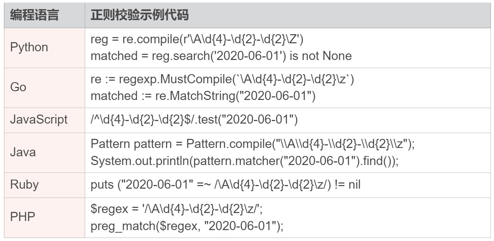
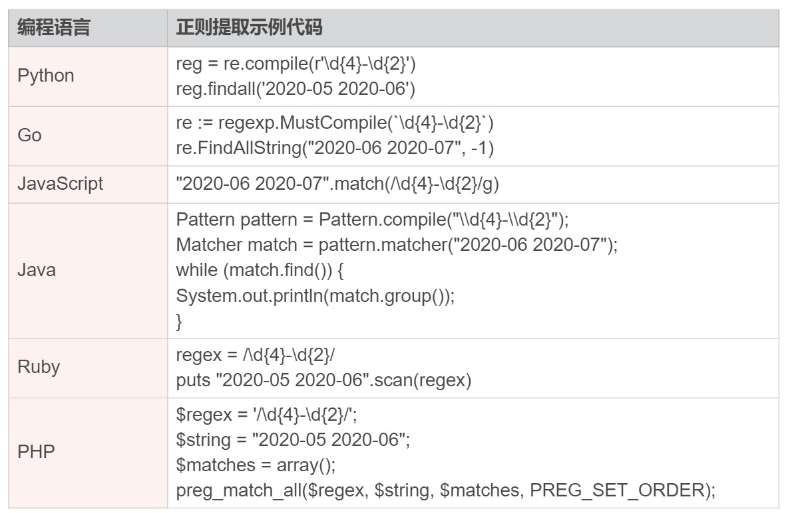
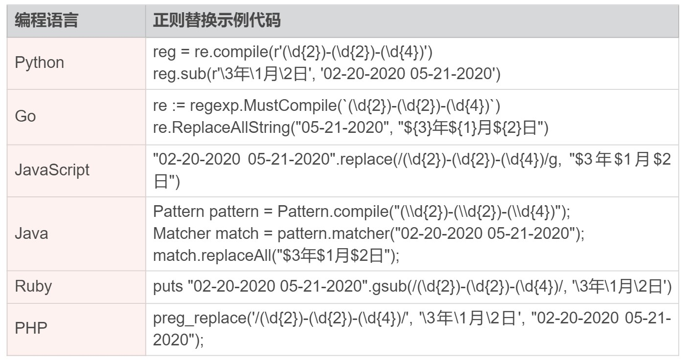
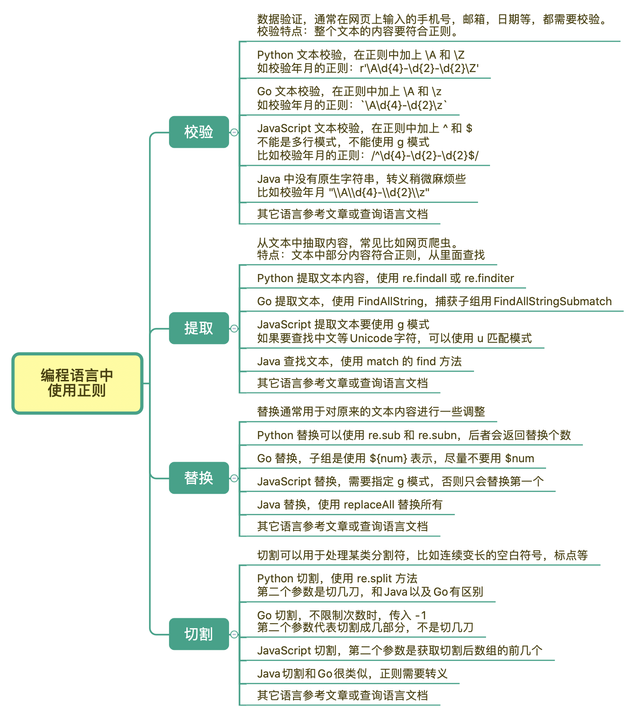

# 10丨应用 3：如何在语言中用正则让文本处理能力上一个台阶？

今天要和你分享的内容是如何在编程语言中使用正则，让文本处理能力上一个台阶。

现代主流的编程语言几乎都内置了正则模块，很少能见到不支持正则的编程语言。学会在编程语言中使用正则，可以极大地提高文本的处理能力。

在进行文本处理时，正则解决的问题大概可以分成四类，分别是：

- 校验文本内容、
- 提取文本内容、
- 替换文本内容、
- 切割文本内容。

在这一节里，我会从功能分类出发，给你讲解在一些常见的编程语言中，如何正确地实现这些功能。

## 校验文本内容

我们先来看一下数据验证，通常我们在网页上输入的手机号、邮箱、日期等，都需要校验。校验的特点在于，整个文本的内容要符合正则，比如要求输入 6 位数字的时候，输入 123456abc 就是不符合要求的。

下面我们以验证日期格式年月日为例子来讲解，比如 `2020-01-01`，我们使用正则 `\d{4}-\d{2}-\d{2}` 来验证。

### Python

在 Python 中，正则的包名是 re，验证文本可以使用 `re.match` 或 `re.search` 的方法，这两个方法的区别在于，`re.match` 是从开头匹配的，`re.search` 是从文本中找子串。下面是详细的解释：

```python
# 测试环境 Python3
>>> import re
>>> re.match(r'\d{4}-\d{2}-\d{2}', '2020-06-01')
<re.Match object; span=(0, 10), match='2020-06-01'>
# 这个输出是匹配到了，范围是从下标 0 到下标 10，匹配结果是 2020-06-01
# re.search 输出结果也是类似的
```

在 Python 中，校验文本是否匹配的正确方式如下所示：

```python
# 测试环境 Python3
>>> import re
>>> reg = re.compile(r'\A\d{4}-\d{2}-\d{2}\Z')  # 建议先编译，提高效率
>>> reg.search('2020-06-01') is not None
True
>>> reg.match('2020-06-01') is not None  # 使用 match 时 \A可省略
True
```

如果不添加 `\A` 和 `\Z` 的话，我们就可能得到错误的结果。而造成这个错误的主要原因就是，**没有完全匹配，而是部分匹配**。至于为什么不推荐用 `^` 和 `$` ，**因为在多行模式下，它们的匹配行为会发现变化**，相关内容在前面匹配模式中讲解过，要是忘记了你可以返回去回顾一下。

```python
# 错误示范
>>> re.match(r'\d{4}-\d{2}-\d{2}', '2020-06-01abc') is not None
True
>>> re.search(r'\d{4}-\d{2}-\d{2}', 'abc2020-06-01') is not None
True
```

### Go

Go 语言（又称 Golang）是 Google 开发的一种静态强类型、编译型、并发型，并具有垃圾回收功能的编程语言。在 Go 语言中，正则相关的包是 regexp，下面是一个完整可运行的示例。

```go

package main
import (
   "fmt"
   "regexp"
)
func main() {
   re := regexp.MustCompile(`\A\d{4}-\d{2}-\d{2}\z`)
   // 输出 true
   fmt.Println(re.MatchString("2020-06-01"))
}
```

保存成 `main.go` ，在配置好 go 环境的前提下，直接使用命令 `go run main.go` 运行。

另外，需要注意的是，和 Python 语言不同，在 Go 语言中，正则尾部断言使用的是  `\z`，而不是 `\Z`。 

如果本地没有 go 环境，可以使用在线的工具运行这些代码，[比如菜鸟工具](https://c.runoob.com/compile/21)

### JavaScript

在 JavaScript 中没有 `\A` 和 `\z`，我们可以使用 `^` 和 `$` 来表示每行的开头和结尾，默认情况下它们是匹配整个文本的开头或结尾（**默认不是多行匹配模式**）。在 JavaScript 中校验文本的时候，不要使用多行匹配模式，因为使用多行模式会改变 `^`  和  `$` 的匹配行为。

JavaScript 代码可以直接在浏览器的 Console 中很方便地测试。（进入方式：任意网页上点击鼠标右键，检查，Console）

```javascript
// 方法1
/^\d{4}-\d{2}-\d{2}$/.test("2020-06-01")  // true

// 方法2
var regex = /^\d{4}-\d{2}-\d{2}$/
"2020-06-01".search(regex) == 0  // true

// 方法3
var regex = new RegExp(/^\d{4}-\d{2}-\d{2}$/)
regex.test("2020-01-01") // tru
```

方法 3 本质上和方法 1 是一样的，方法 1 写起来更简洁。需要注意的是，在使用 RegExp 对象时，如果使用 g 模式，可能会有意想不到的结果，连续调用会出现第二次返回 false 的情况，就像下面这样：

```javascript
var r = new RegExp(/^\d{4}-\d{2}-\d{2}$/, "g")
r.test("2020-01-01") // true
r.test("2020-01-01") // false
```

这是因为 RegExp 在全局模式下，正则会找出文本中的所有可能的匹配，找到一个匹配时会记下 lastIndex，在下次再查找时找不到，lastIndex 变为 0，所以才有上面现象。

```javascript
var regex = new RegExp(/^\d{4}-\d{2}-\d{2}$/, "g")
regex.test("2020-01-01") // true
regex.lastIndex // 10
regex.test("2020-01-01") // false
regex.lastIndex // 0
// 为了加深理解，你可以看下面这个例子
var regex = new RegExp(/\d{4}-\d{2}-\d{2}/, "g")
regex.test("2020-01-01 2020-02-02") // true
regex.lastIndex // 10
regex.test("2020-01-01 2020-02-02") // true
regex.lastIndex // 21
regex.test("2020-01-01 2020-02-02") // false
```

由于我们这里是文本校验，并不需要找出所有的。所以要记住，JavaScript 中文本校验在使用 RegExp 时不要设置 g 模式。

另外在 ES6 中添加了匹配模式 u，如果要在 JavaScript 中匹配中文等多字节的 Unicode 字符，可以指定匹配模式 u，比如测试是否为一个字符，可以是任意 Unicode 字符，详情可以参考下面的示例：

```javascript
/^\u{1D306}$/u.test("𝌆") // true
/^\u{1D306}$/.test("𝌆") // false
/^.$/u.test("好") // true
/^.$/u.test("好人") // false
/^.$/u.test("a") // true
/^.$/u.test("ab") // false
```

### Java

在 Java 中，正则相关的类在 `java.util.regex` 中，其中最常用的是 Pattern 和 Matcher：

- Pattern 是正则表达式对象
- Matcher 是匹配到的结果对象

Pattern 和 字符串对象关联，可以得到一个 Matcher。下面是 Java 中匹配的示例：

```java
import java.util.regex.Matcher;
import java.util.regex.Pattern;
class Main {
  public static void main(String[] args) {
    //方法1，可以不加 \A 和 \z
    System.out.println(Pattern.matches("\\d{4}-\\d{2}-\\d{2}", "2020-06-01")); // true
    //方法2，可以不加 \A 和 \z
    System.out.println("2020-06-01".matches("\\d{4}-\\d{2}-\\d{2}")); // true
    
    //方法3，必须加上 \A 和 \z
    Pattern pattern = Pattern.compile("\\A\\d{4}-\\d{2}-\\d{2}\\z");
    System.out.println(pattern.matcher("2020-06-01").find()); // true
  }
}
```

Java 中目前还没有原生字符串，在之前转义一节讲过，正则需要经过字符串转义和正则转义两个步骤，因此在用到反斜扛的地方，比如表示数字的 `\d`，就得在字符串中表示成 `\\d`，转义会让书写正则变得稍微麻烦一些，在使用的时候需要留意一下。

### 小结

部分常见编程语言校验文本方式，你可以参考下面的表。



## 提取文本内容

我们再来看一下文本内容提取，**所谓内容提取，就是从大段的文本中抽取出我们关心的内容**。比较常见的例子是网页爬虫，或者说从页面上提取邮箱、抓取需要的内容等。如果要抓取的是某一个网站，页面样式是一样的，要提取的内容都在同一个位置，可以使用 xpath 或 jquery 选择器 等方式，否则就只能使用正则来做了。

下面我们来讲解一下具体的例子，让你了解一下正则提取文本在一些常见的编程语言中的使用。

### Python

在 Python 中提取内容最简单的就是使用 `re.findall` 方法了，当有子组的时候，会返回子组的内容，没有子组时，返回整个正则匹配到的内容。下面我以查找日志的年月为例进行讲解，年月可以用正则 `\d{4}-\d{2}`  来表示：

```python
# 没有子组时
>>> import re
>>> reg = re.compile(r'\d{4}-\d{2}')
>>> reg.findall('2020-05 2020-06')
['2020-05', '2020-06']

# 有子组时
>>> reg = re.compile(r'(\d{4})-(\d{2})')
>>> reg.findall('2020-05 2020-06')
[('2020', '05'), ('2020', '06')]
```

通过上面的示例你可以看到，直接使用 findall 方法时，它会把结果存储到一个列表（数组）中，一下返回所有匹配到的结果。如果想节约内存，可以采用迭代器的方式来处理，就像下面这样：

```python
>>> import re
>>> reg = re.compile(r'(\d{4})-(\d{2})')
>>> for match in reg.finditer('2020-05 2020-06'):
...     print('date: ', match[0])  # 整个正则匹配到的内容
...     print('year: ', match[1])  # 第一个子组
...     print('month:', match[2])  # 第二个子组
...
date:  2020-05
year:  2020
month: 05
date:  2020-06
year:  2020
month: 06
```

这样我们就可以实现正则找到一个，在程序中处理一个，不需要将找到的所有结果构造成一个数组（Python 中的列表）。

### Go

在 Go 语言里面，查找也非常简洁，可以直接使用 FindAllString 方法。如果我们想捕获子组，可以使用 FindAllStringSubmatch 方法。

```go
package main
import (
  "fmt"
  "regexp"
)
func main() {
  re := regexp.MustCompile(`\d{4}-\d{2}`)
  
  // 返回一个切片(可动态扩容的数组) [2020-06 2020-07]
  fmt.Println(re.FindAllString("2020-06 2020-07", -1)) 
  
  // 捕获子组的查找示例
  re2 := regexp.MustCompile(`(\d{4})-(\d{2})`)
  // 返回结果和上面 Python 类似
  for _, match := range re2.FindAllStringSubmatch("2020-06 2020-07", -1) {
     fmt.Println("date: ", match[0])
     fmt.Println("year: ", match[1])
     fmt.Println("month:", match[2])
  }
}
```

### JavaScript

在 JavaScript 中，**想要提取文本中所有符合要求的内容，正则必须使用 g 模式，否则找到第一个结果后，正则就不会继续向后查找了**。

```javascript
// 使用g模式，查找所有符合要求的内容
"2020-06 2020-07".match(/\d{4}-\d{2}/g)
// 输出：["2020-06", "2020-07"]

// 不使用g模式，找到第一个就会停下来
"2020-06 2020-07".match(/\d{4}-\d{2}/)
// 输出：["2020-06", index: 0, input: "2020-06 2020-07", groups: undefined]
```

如果要查找中文等 Unicode 字符，可以使用 u 匹配模式，下面是具体的示例。

```javascript
'𝌆'.match(/\u{1D306}/ug) // 使用匹配模式u
["𝌆"]
'𝌆'.match(/\u{1D306}/g) // 不使用匹配模式u
null
// 如果你对这个符号感兴趣，可以参考 https://unicode-table.com/cn/1D306
```

### Java

在 Java 中，可以使用 Matcher 的 find 方法来获取查找到的内容，就像下面这样：

```java
import java.util.regex.Matcher;
import java.util.regex.Pattern;
class Main {
  public static void main(String[] args) {    
    Pattern pattern = Pattern.compile("\\d{4}-\\d{2}");
    Matcher match = pattern.matcher("2020-06 2020-07");
    while (match.find()) {
      System.out.println(match.group());      
    }
  }
}
```

### 小结

部分常见编程语言提取文本方式，你可以参考下面的表。



## 替换文本内容

我们接着来看一下文本内容替换，替换通常用于对原来的文本内容进行一些调整。之前我们也讲解过一些使用正则进行替换的例子，今天我们再来了解一下在部分常见的编程语言中，使用正则进行文本替换的方法。

### Python

在 Python 中替换相关的方法有 re.sub 和 re.subn，后者会返回替换的次数。下面我以替换年月的格式为例进行讲解，假设原始的日期格式是月日年，我们要将其处理成 xxxx 年 xx 月 xx 日的格式。你可以看到，在 Python 中正则替换操作相关的方法，使用起来非常地简单。

```python
>>> import re
>>> reg = re.compile(r'(\d{2})-(\d{2})-(\d{4})')
>>> reg.sub(r'\3年\1月\2日', '02-20-2020 05-21-2020')
'2020年02月20日 2020年05月21日'

# 可以在替换中使用 \g<数字>，如果分组多于10个时避免歧义
>>> reg.sub(r'\g<3>年\g<1>月\g<2>日', '02-20-2020 05-21-2020')
'2020年02月20日 2020年05月21日'

# 返回替换次数
>>> reg.subn(r'\3年\1月\2日', '02-20-2020 05-21-2020')
('2020年02月20日 2020年05月21日', 2)
```

### Go

在 Go 语言里面，替换和 Python 也非常类似，只不过子组是使用 `${num}` 的方式来表示的。

```go

package main
import (
  "fmt"
  "regexp"
)
func main() {
  re := regexp.MustCompile(`(\d{2})-(\d{2})-(\d{4})`)
  
  // 示例一，返回 2020年02月20日 2020年05月21日
  fmt.Println(re.ReplaceAllString("02-20-2020 05-21-2020", "${3}年${1}月${2}日"))
  
  // 示例二，返回空字符串，因为"3年"，"1月"，"2日" 这样的子组不存在
  fmt.Println(re.ReplaceAllString("02-20-2020 05-21-2020", "$3年$1月$2日"))
  
  // 示例三，返回 2020-02-20 2020-05-21
  fmt.Println(re.ReplaceAllString("02-20-2020 05-21-2020", "$3-$1-$2"))
}
```

### JavaScript

在 JavaScript 中替换和查找类似，需要指定 g 模式，否则只会替换第一个，就像下面这样。

```javascript
// 使用g模式，替换所有的
"02-20-2020 05-21-2020".replace(/(\d{2})-(\d{2})-(\d{4})/g, "$3年$1月$2日")
// 输出 "2020年02月20日 2020年05月21日"

// 不使用 g 模式时，只替换一次
"02-20-2020 05-21-2020".replace(/(\d{2})-(\d{2})-(\d{4})/, "$3年$1月$2日")
// 输出 "2020年02月20日 05-21-2020"
```

### Java

在 Java 中，一般是使用 replaceAll 方法进行替换，一次性替换所有的匹配到的文本。

```java
import java.util.regex.Matcher;
import java.util.regex.Pattern;
class Main {
  public static void main(String[] args) {
    //方法1，输出 2020年02月20日 2020年05月21日
    System.out.println("02-20-2020 05-21-2020".replaceAll("(\\d{2})-(\\d{2})-(\\d{4})", "$3年$1月$2日"));
    
    //方法2，输出 2020年02月20日 2020年05月21日
    final Pattern pattern = Pattern.compile("(\\d{2})-(\\d{2})-(\\d{4})");
    Matcher match = pattern.matcher("02-20-2020 05-21-2020");
    System.out.println(match.replaceAll("$3年$1月$2日"));
  }
}
```

### 小结



##  切割文本内容

我们最后再来看一下文本内容切割，**通常切割用于变长的空白符号，多变的标点符号等**。

下面我们来讲解一下具体的例子，让你了解一下正则切割文本在部分常见编程语言中的使用。

### Python

在 Python 中切割相关的方法是 re.split。如果我们有按照任意空白符切割的需求，可以直接使用字符串的 split 方法，不传任何参数时就是按任意连续一到多个空白符切割。

```python

# 使用字符串的切割方法
>>> "a b  c\n\nd\t\n \te".split()
['a', 'b', 'c', 'd', 'e']
```

使用正则进行切割，比如我们要通过标点符号切割，得到所有的单词（这里简单使用非单词组成字符来表示）。

```python
>>> import re
>>> reg = re.compile(r'\W+')
>>> reg.split("apple, pear! orange; tea")
['apple', 'pear', 'orange', 'tea']

# 限制切割次数，比如切一刀，变成两部分
>>> reg.split("apple, pear! orange; tea", 1)
['apple', 'pear! orange; tea']
```

### Go

在 Go 语言里面，切割是 Split 方法，和 Python 非常地类似，只不过 Go 语言中这个方法的第二个参数是必传的，如果不限制次数，我们传入 -1 即可。

```go

package main
import (
  "fmt"
  "regexp"
)
func main() {
  re := regexp.MustCompile(`\W+`)
  
  // 返回 []string{"apple", "pear", "orange", "tea"}
  fmt.Printf("%#v", re.Split("apple, pear! orange; tea", -1)
}
```

但在 Go 语言中，有个地方和 Python 不太一样，就是传入的第二个参数代表切割成几个部分，而不是切割几刀。

```go
// 返回 []string{"apple", "pear! orange; tea"}
fmt.Printf("%#v\n", re.Split("apple, pear! orange; tea", 2))

// 返回 []string{"apple"}
fmt.Printf("%#v\n", re.Split("apple", 2))
```

### JavaScript

在 JavaScript 中，正则的切割和刚刚讲过的 Python 和 Go 有些类似，但又有区别。当第二个参数是 2 的时候，**表示切割成 2 个部分，而不是切 2 刀（Go 和 Java 也是类似的）**，但数组的内容不是 apple 后面的剩余部分，而是全部切割之后的 pear，你可以注意比较一下。

```javascript
"apple, pear! orange; tea".split(/\W+/)
// 输出：["apple", "pear", "orange", "tea"]

// 传入第二个参数的情况
"apple, pear! orange; tea".split(/\W+/, 1)
// 输出 ["apple"]

"apple, pear! orange; tea".split(/\W+/, 2)
// 输出 ["apple", "pear"]

"apple, pear! orange; tea".split(/\W+/, 10)
// 输出 ["apple", "pear", "orange", "tea"]
```

### Java

Java 中切割也是类似的，由于没有原生字符串，转义稍微麻烦点。

```java
import java.util.regex.Matcher;
import java.util.regex.Pattern;
class Main {
  public static void main(String[] args) {
    Pattern pattern = Pattern.compile("\\W+");
    for(String s : pattern.split("apple, pear! orange; tea")) {
      System.out.println(s);
    }
  }
}
```

在 Java 中，也可以传入第二个参数，类似于 Go 的结果。

```java

pattern.split("apple, pear! orange; tea", 2)
// 返回 "apple" 和 "pear! orange; tea"
```

### 小结

部分常见编程语言切割文本方式，你可以参考下面的表。


## 总结

今天我们学习了正则解决的问题大概可以分成四类，分别是校验文本内容、提取文本内容、替换文本内容、切割文本内容。从这四个功能出发，我们学习了在一些常见的编程语言中，如何正确地使用相应的方法来实现这些功能。这些方法都比较详细，希望你能够认真练习，掌握好这些方法。

我给你总结了一个今天所讲内容的详细脑图，你可以长按保存下来，经常回顾一下：



## 课后思考

很多网页为了防止爬虫，喜欢把邮箱里面的 `@` 符号替换成 `#` 符号，你可以写一个正则，兼容一下这种情况么？

```
例如网页的底部可能是这样的：
联系邮箱：xxx#163.com (请把 # 换成 @)
```

最简单的 `\b\w+[#@]\w+.\w+\b`，题意是要兼容 `@` 和 `#`，而不是替换

