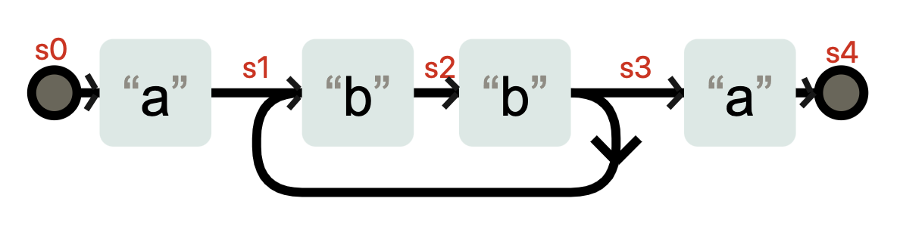
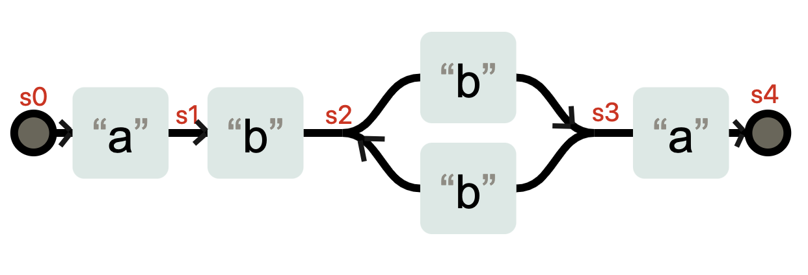
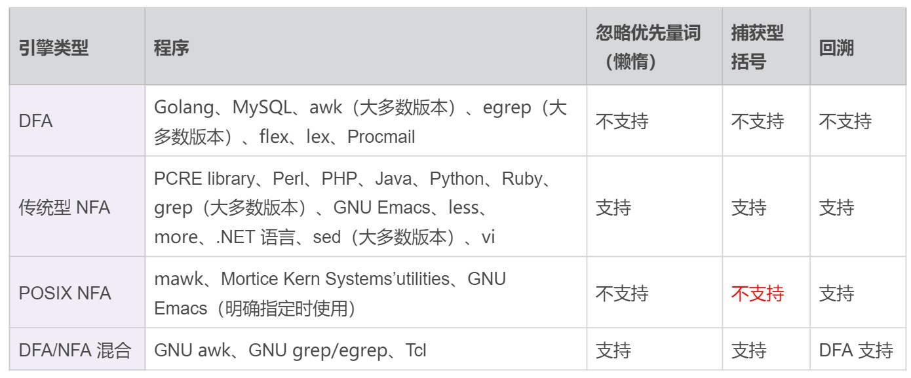
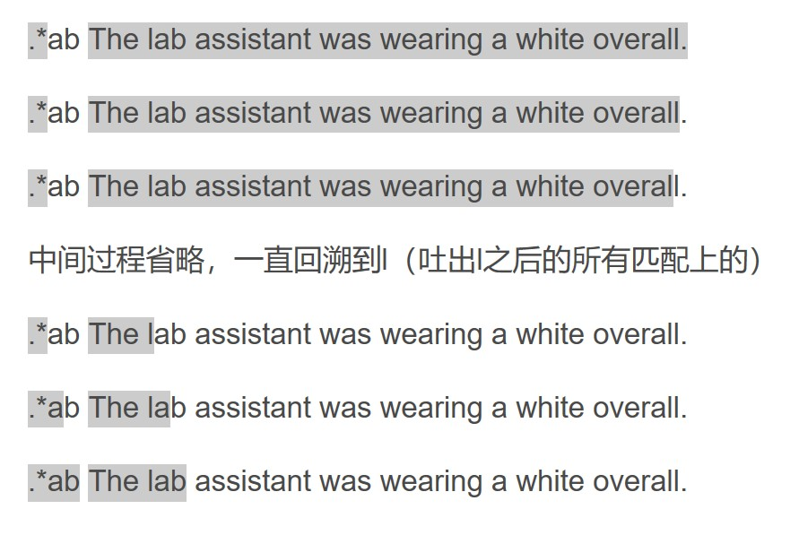
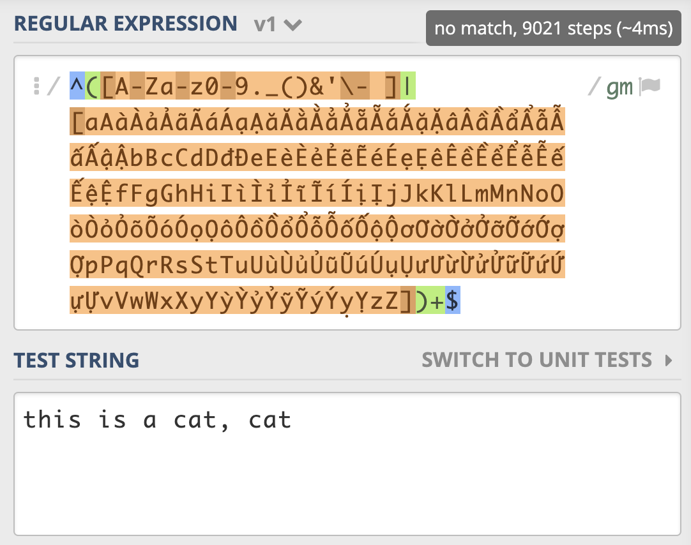
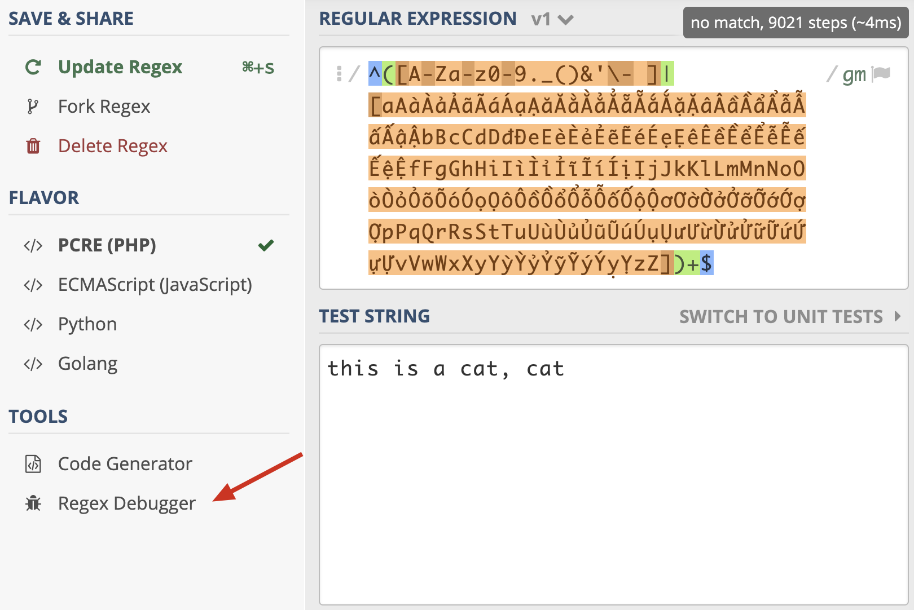
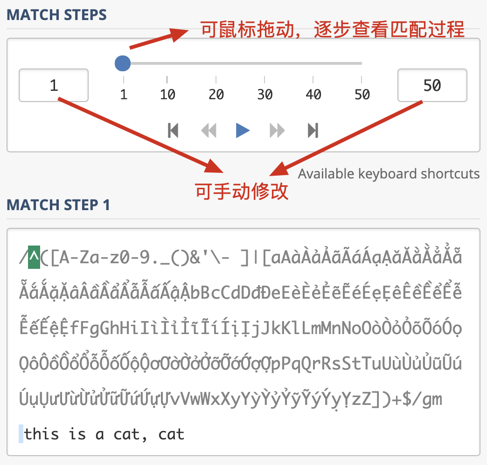
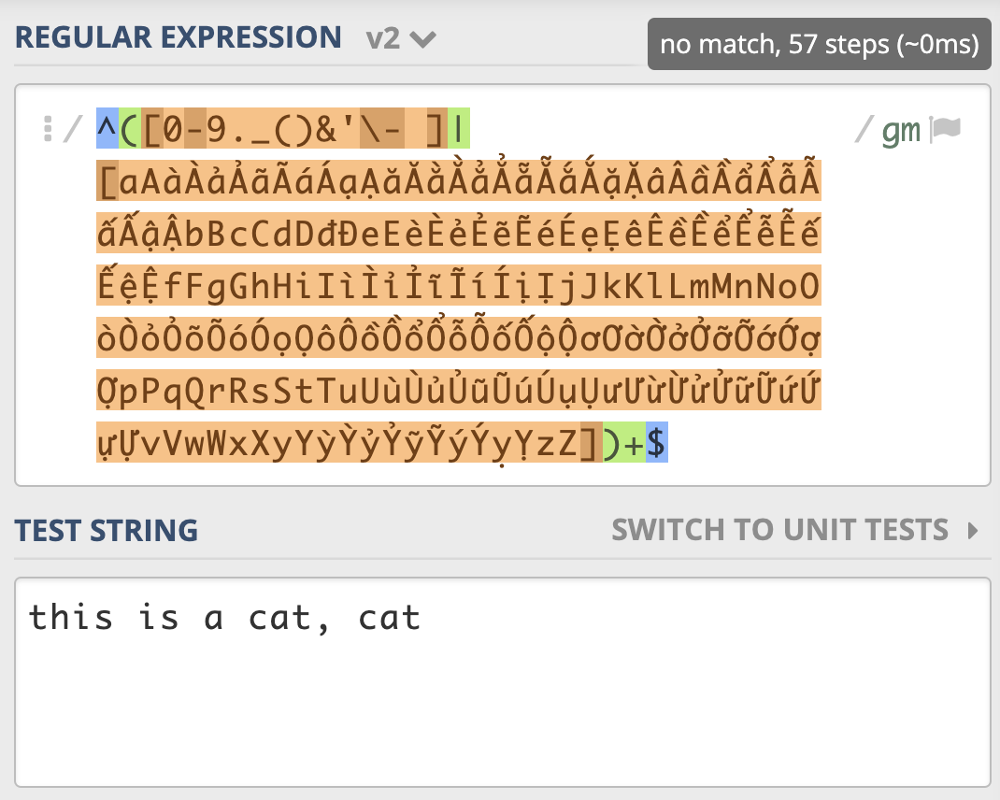
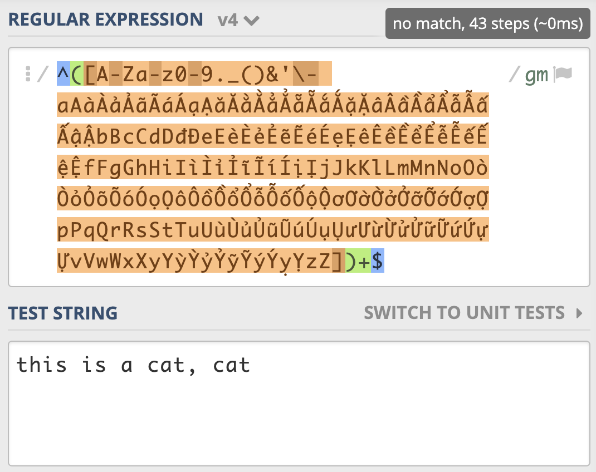
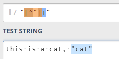

# 11丨如何理解正则的匹配原理以及优化原则？

这一节课我们一起来学习正则匹配原理相关的内容，以及在书写正则时的一些优化方法。

这节课我主要给你讲解一下正则匹配过程，回顾一下之前讲的回溯，以及 DFA 和 NFA 引擎的工作方式，方便你明白正则是如何进行匹配的。这些原理性的知识，能够帮助我们快速理解为什么有些正则表达式不符合预期，也可以避免一些常见的错误。只有了解正则引擎的工作原理，我们才可以更轻松地写出正确的，性能更好的正则表达式。

## 有穷状态自动机

正则之所以能够处理复杂文本，就是因为采用了 **有穷状态自动机（finite automaton）。** 那什么是有穷自动机呢？

- 有穷状态是指一个系统具有有穷个状态，不同的状态代表不同的意义。

- 自动机是指系统可以根据相应的条件，在不同的状态下进行转移。

  从一个初始状态，根据对应的操作（比如录入的字符集）执行状态转移，最终达到终止状态（可能有一到多个终止状态）。

有穷自动机的具体实现称为正则引擎，主要有 DFA 和 NFA 两种，其中 NFA 又分为传统的 NFA 和 POSIX NFA：

- DFA：确定性有穷自动机（Deterministic finite automaton）
- NFA：非确定性有穷自动机（Non-deterministic finite automaton）
  - 传统的 NFA
  - POSIX NFA

接下来我们来通过一些示例，来详细看下正则表达式的匹配过程。

## 正则的匹配过程

在使用到编程语言时，我们经常会 「编译」一下正则表达式，来提升效率，比如在 Python3 中它是下面这样的：

```python
>>> import re
>>> reg = re.compile(r'a(?:bb)+a')
>>> reg.findall('abbbba')
['abbbba']
```

这个编译的过程，**其实就是生成自动机的过程**，正则引擎会拿着这个自动机去和字符串进行匹配。生成的自动机可能是这样的（下图是使用 [Regexper 工具生成](https://github.com/javallone/regexper-static)，再次加工得到的）。比如上图中的 `a(?:bb)+a` 可以 [使用在线的 Regexper 工具生成下图类似的图片](https://regexper.com/#a%28%3F%3Abb%29%2Ba) （友情提示：`(?:)` 小括号中的 `?:` 表示不捕获分组）



在状态 s3 时，不需要输入任何字符，状态也有可能转换成 s1。你可以理解成 `a(bb)+a`  在匹配了字符 `abb` 之后，到底在 s3 状态，还是在 s1 状态，这是不确定的。**这种状态机就是非确定性有穷状态自动机（Non-deterministic finite automaton 简称 NFA）**。

**NFA 和 DFA 是可以相互转化的，** 当我们把上面的状态表示成下面这样，就是一台 DFA 状态机了，因为在 s0-s4 这几个状态，每个状态都需要特定的输入，才能发生状态变化。



那这两种状态机的工作方式到底有什么不同呢？我们接着往下看。

## DFA& NFA 工作机制

下面我通过一个示例，来简单说明 **NFA 与 DFA 引擎工作方式的区别**：

```
字符串：we study on jikeshijian app
正则：jike(zhushou|shijian|shixi)
```

### NFA 引擎工作方式

**NFA 引擎的工作方式是**，先看正则，再看文本，而且以正则为主导。

正则中的第一个字符是 j，NFA 引擎在字符串中查找 j，接着匹配其后是否为 i ，如果是 i 则继续，这样一直找到 jike。

```

regex: jike(zhushou|shijian|shixi)
          ^
text: we study on jikeshijian app
                     ^
```

我们再根据正则看文本后面是不是 z，发现不是，此时 zhushou 分支淘汰。

```
regex: jike(zhushou|shijian|shixi)
            ^
         淘汰此分支(zhushou)
text: we study on jikeshijian app
                      ^
```

我们接着看其它的分支，看文本部分是不是 s，直到 shijian 整个匹配上。shijian 在匹配过程中如果不失败，就不会看后面的 shixi 分支。当匹配上了 shijian 后，整个文本匹配完毕，也不会再看 shixi 分支。

假设这里文本改一下，把 jikeshijian 变成 jikeshixi，正则 shi**j**ian 的 j 匹配不上时 shixi 的 x，会接着使用正则 shixi 来进行匹配，重新从 s 开始（NFA 引擎会记住这里）。

```

第二个分支匹配失败
regex: jike(zhushou|shijian|shixi)
                       ^
                  淘汰此分支(正则j匹配不上文本x)
text: we study on jikeshixi app
                         ^
再次尝试第三个分支
regex: jike(zhushou|shijian|shixi)
                            ^
text: we study on jikeshixi app
                      ^
```

也就是说， **NFA 是以正则为主导，反复测试字符串**，这样字符串中同一部分，有可能被反复测试很多次。

### DFA 引擎工作方式

而 DFA 不是这样的，**DFA 会先看文本，再看正则表达式，是以文本为主导的**。

在具体匹配过程中，DFA 会从 we 中的 w 开始依次查找 j，定位到 j ，这个字符后面是 i。所以我们接着看正则部分是否有 i ，如果正则后面是个 i ，那就以同样的方式，匹配到后面的 ke。

```
text: we study on jikeshijian app
                     ^
regex: jike(zhushou|shijian|shixi)
```

继续进行匹配，文本 e 后面是字符 s ，DFA 接着看正则表达式部分，此时 zhushou 分支被淘汰，开头是 s 的分支 shijian 和 shixi 符合要求。

```

text: we study on jikeshijian app
                      ^
regex: jike(zhushou|shijian|shixi)
            ^       ^       ^
           淘汰     符合    符合
```

然后 DFA 依次检查字符串，检测到 shijian 中的 j 时，只有 shijian 分支符合，淘汰 shixi，接着看分别文本后面的 ian，和正则比较，匹配成功。

```

text: we study on jikeshijian app
                         ^
regex: jike(zhushou|shijian|shixi)
                       ^       ^
                      符合     淘汰
```

从这个示例你可以看到，DFA 和 NFA 两种引擎的工作方式完全不同。

- NFA 是以表达式为主导的，先看正则表达式，再看文本。
- 而 DFA 则是以文本为主导，先看文本，再看正则表达式。

一般来说，DFA 引擎会更快一些，因为整个匹配过程中，字符串只看一遍，不会发生回溯，相同的字符不会被测试两次。也就是说 DFA 引擎执行的时间一般是线性的。DFA 引擎可以确保匹配到可能的最长字符串。**但由于 DFA 引擎只包含有限的状态，所以它没有反向引用功能**；并且因为它不构造显示扩展，它也不支持捕获子组。

NFA  以表达式为主导，它的引擎是使用  **贪心匹配回溯算法实现**。NFA  通过构造特定扩展，支持子组和反向引用。但由于 NFA 引擎会发生回溯，即它会对字符串中的同一部分，进行很多次对比。因此，在最坏情况下，它的执行速度可能非常慢。

## POSIX NFA 与 传统 NFA 区别

因为传统的 NFA 引擎「急于」报告匹配结果，找到第一个匹配上的就返回了，所以可能会导致还有更长的匹配未被发现。比如使用正则 `pos|posix`  在文本 posix 中进行匹配，传统的 NFA 从文本中找到的是 pos，而不是 posix，而 POSIX NFA 找到的是 posix。


POSIX NFA 的应用很少，主要是 Unix/Linux 中的某些工具。POSIX NFA 引擎与传统的 NFA 引擎类似，但不同之处在于，POSIX NFA 在找到可能的最长匹配之前会继续回溯，也就是说它会尽可能找最长的，如果分支一样长，以最左边的为准（`The Longest-Leftmost`）。因此，POSIX NFA 引擎的速度要慢于传统的 NFA 引擎。

我们日常面对的，**一般都是传统的 NFA，所以通常都是 最左侧 的分支优先**，在书写正则的时候务必要注意这一点。

下面是 DFA、传统 NFA 以及 POSIX NFA 引擎的特点总结：



## 回溯

回溯是 NFA 引擎才有的，并且只有在正则中出现 **量词** 或 **多选分支结构** 时，才可能会发生回溯。

比如我们使用正则 `a+ab` 来匹配 文本  `aab` 的时候，过程是这样的：

1. `a+` 是贪婪匹配，会占用掉文本中的两个 a
2. 但正则接着又是 a，文本部分只剩下 b，只能通过回溯，让 `a+` 吐出一个 a，再次尝试。

如果正则是使用 `.*ab` 去匹配一个比较长的字符串就更糟糕了，因为 `.*` 会吃掉整个字符串（不考虑换行，假设文本中没有换行），然后，你会发现正则中还有 ab 没匹配到内容，只能将 ` .*`  匹配上的字符串吐出一个字符，再尝试，还不行，再吐出一个，不断尝试。



所以在工作中，我们要尽量不用 `.*`  ，除非真的有必要，因为点能匹配的范围太广了，**我们要尽可能精确**。常见的解决方式有两种，比如要提取引号中的内容时：

- 使用 `[^"]+`
- 或者使用非贪婪的方式 `.+?` ，来减少 **匹配上的内容不断吐出，再次尝试** 的过程。

我们再回头看一下之前讲解的店铺名匹配示例：



为了简单，笔者测试的文本和正则如下（除了匹配步骤是 43 次之外，回溯是从 `cat,` t 开始回溯的）

```
正则：^([A-Za-z0-9._()&'\- ])+$
文本：this is a cat, cat
```

从示例（图例右上角）我们可以看到，一个很短的字符串，NFA 引擎尝试步骤达到了 9021 次，由于是贪婪匹配，第一个分支能匹配上 `this is a cat` 部分，接着后面的逗号匹配失败，使用第二个分支匹配，再次失败，此时贪婪匹配部分结束。NFA 引擎接着用正则后面的 `$` 来进行匹配，但此处不是文本结尾，匹配不上，发生回溯，吐出第一个分支匹配上的 t，使用第二个分支匹配 t 再试，还是匹配不上。


我们继续回溯，第二个分支匹配上的 t 吐出，第一个分支匹配上的 a 也吐出，再用第二个分支匹配 a 再试，如此发生了大量的回溯。你可以使用 regex101.com 中的 Regex Debugger 来调试一下这个过程，加深你的理解。





我们来尝试优化一下，把第一个分支中的 `A-Za-z` 去掉，因为后面多选分支结构中重复了，我们再看一下正则尝试匹配的次数（示例），可以看到只尝试匹配了 57 次就结束了。



**所以一定要记住，不要在多选择分支中，出现重复的元素**。到这里，你对之前文章提到的「回溯不可怕，我们要尽量减少回溯后的判断」 是不是有了进一步的理解呢？

另外，之前我们说的独占模式，你可以把它可以理解为贪婪模式的一种优化，它也会发生广义的回溯，但它不会吐出已经匹配上的字符。独占模式匹配到英文逗号那儿，不会吐出已经匹配上的字符，匹配就失败了，所以采用独占模式也能解决性能问题。


但要提醒你的是，独占模式 **不吐出已匹配字符** 的特性，会使得一些场景不能使用它。另外，只有少数编程语言支持独占模式。

解决这个问题还有其它的方式，比如我们可以 **尝试移除多选分支选择结构**，**直接用中括号表示多选一**



我们会发现性能也是有显著提升（这里只是测试，真正使用的时候，重复的元素都应该去掉，另外这里也不需要保存子组）。

## 优化建议

学习了原理之后，有助于我们写出更好的正则。我们必须先保证正则的功能是正确的，然后再进行优化性能，下面我给了你一些优化的方法供你参考。

### 1. 测试性能的方法

我们可以使用 ipython 来测试正则的性能，ipython 是一个 Python shell 增强交互工具，在 `macOS/Windows/Linux ` 上都可以安装使用。在测试正则表达式时，它非常有用，比如下面通过一个示例，来测试在字符串中查找 abc 时的时间消耗。

```bash
# ipython 安装
pip install  ipython
# 验证
 ipython
Python 3.8.6 (tags/v3.8.6:db45529, Sep 23 2020, 15:52:53) [MSC v.1927 64 bit (AMD64)]
Type 'copyright', 'credits' or 'license' for more information
IPython 7.19.0 -- An enhanced Interactive Python. Type '?' for help.

In [1]:    # 就已经进入了 ipython 的交互式环境了
# 笔者这里测试，报 SyntaxError: invalid syntax
```


```python
In [1]: import re
In [2]: x = '-' * 1000000 + 'abc'
In [3]: timeit re.search('abc', x)
480 µs ± 8.06 µs per loop (mean ± std. dev. of 7 runs, 1000 loops each)
```

另外，你也可以通过前面 regex101.com 查看正则和文本匹配的次数，来得知正则的性能信息。

### 2. 提前编译好正则

编程语言中一般都有 **编译** 方法，我们可以使用这个方法提前将正则处理好，这样不用在每次使用的时候去反复构造自动机，从而可以提高正则匹配的性能。

```python

>>> import re
>>> reg = re.compile(r'ab?c')  # 先编译好，再使用
>>> reg.findall('abc')
['abc']
>>> re.findall(r'ab?c', 'abc')  # 正式使用不建议，但测试功能时较方便
['abc']
```

### 3. 尽量准确表示匹配范围

比如我们要匹配引号里面的内容，除了写成 `".+?"` 之外，我们可以写成 `"[^"]+"`。使用 [^"] 要比使用点号好很多，虽然使用的是贪婪模式，但它不会出现点号将引号匹配上，再吐出的问题。



上面 的区别如下：

- `".+"`：如果使用贪婪模式，那么将会导致第一遍，将最后一个引号 `"` 吃掉，再回溯（吐出来）匹配正则里面的最后一个引号

- `".+?"`：使用了非贪婪模式，不会导致发生回溯

- `"[^"]+"`：贪婪模式，引号开头结尾，中间用中括号选用非引号的字符出现 1 到多次

  也不会发生回溯

### 4. 提取出公共部分

通过上面对 NFA 引擎的学习，相信你应该明白 `(abcd|abxy)` 这样的表达式，可以优化成 `ab(cd|xy)`，因为 NFA 以正则为主导，会导致字符串中的某些部分重复匹配多次，影响效率。

因此我们会知道 `th(?:is|at)` 要比 `this|that` 要快一些，但从可读性上看，后者要好一些，这个就需要用的时候去权衡，也可以添加代码注释让代码更容易理解。

类似地，如果是锚点，比如 `(^this|^that) is` 这样的，锚点部分也应该独立出来，可以写成比如  `^th(is|at) is` 的形式，因为锚点部分也是需要尝试去匹配的，匹配次数要尽可能少。

### 5. 出现可能性大的放左边

**由于正则是从左到右看的，把出现概率大的放左边**，域名中 `.com`  的使用是比 `.net`  多的，所以我们可以写成\. `(?:com|net)\b` ，而不是 `\.(?:net|com)\b`。

### 6. 只在必要时才使用子组

在正则中，**括号可以用于归组，但如果某部分后续不会再用到，就不需要保存成子组**。通常的做法是，在写好正则后，把不需要保存子组的括号中加上 `?:`  来表示只用于归组。如果保存成子组，正则引擎必须做一些额外工作来保存匹配到的内容，因为后面可能会用到，这会降低正则的匹配性能。

### 7. 警惕嵌套的子组重复

如果一个组里面包含重复，接着这个组整体也可以重复，比如 `(.*)*`  这个正则，匹配的次数会呈指数级增长，所以尽量不要写这样的正则。

### 8. 避免不同分支重复匹配

在多选分支选择中，要避免不同分支出现相同范围的情况，上面回溯的例子中，我们已经进行了比较详细的讲解。

## 总结

今天带你简单学习了有穷自动机的概念，自动机的具体实现称之为正则引擎。

我们学习了正则引擎的匹配原理，NFA 和 DFA 两种引擎的工作方式完全不同，NFA 是以表达式为主导的，先看正则表达式，再看文本。而 DFA 则是以文本为主导的，先看文本，再看正则表达式。POSIX NFA 是指符合 POSIX 标准的 NFA 引擎，它会不断回溯，以确保找到最左侧最长匹配。

接着我们学习了测试正则表达式性能的方法，以及优化的一些方法，比如提前编译好正则，提取出公共部分，尽量准确地表示范围，必要时才使用子组等。


## 课后思考

最后，我们来做一个小练习吧。通过今天学习的内容，这里有一个示例，要求匹配： **由字母或数字组成的字符串，但第一个字符要是小写英文字母，你能说一下针对这个示例，NFA 引擎的匹配过程么？**

```
文本：a12
正则：^(?=[a-z])[a-z0-9]+$
```

答：环视只匹配位置，是零宽度的，区别就在于这儿。

元字符 `^` 和 `$` 匹配的只是位置，顺序环视 `(?=[a-z])` 只进行匹配，并不占有字符，也不将匹配的内容保存到最终的匹配结果，所以都是零宽度的。

匹配过程：

- 首先由元字符 `^` 取得控制权，从位置 0 开始匹配，`^` 匹配的就是开始位置 `位置0` ，匹配成功，控制权交给顺序环视 `(?=[a-z])`；

- `(?=[a-z])` 要求它所在位置右侧必须是字母才能匹配成功，**零宽度的子表达式之间是不互斥的**，即同一个位置可以同时由多个零宽度子表达式匹配，所以它也是从位置 0 尝试进行匹配，位置 0 的右侧是字符 `a`，符合要求，匹配成功，控制权交给 `[a-z0-9]+`；

- 因为 `(?=[a-z])` 只进行匹配，并不将匹配到的内容保存到最后结果，并且 `(?=[a-z])` 匹配成功的位置是位置 0，所以 `[a-z0-9]+` 也是从位置 0 开始尝试匹配的，`[a-z0-9]+` 首先尝试匹配 `a`，匹配成功，继续尝试匹配，可以成功匹配接下来的 `1` 和 `2` ，此时已经匹配到位置 3，位置 3 的右侧已没有字符，这时会把控制权交给 `$`；

- 元字符 `$` 从位置 3 开始尝试匹配，它匹配的是结束位置，也就是 `位置 3`，匹配成功。

此时正则表达式匹配完成，报告匹配成功。匹配结果为 `a12` ，开始位置为 0，结束位置为 3。其中：

- `^` 匹配位置`0`，
- `(?=[a-z])` 匹配位置 0
- `[a-z0-9]+` 匹配字符串 `a12`
- `$` 匹配位置 3。

可以参考 https://blog.csdn.net/lxcnn/article/details/4304651