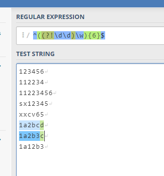
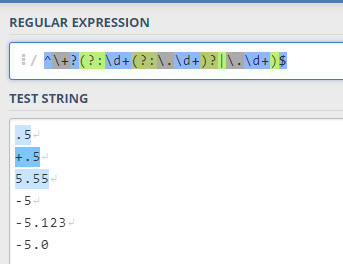
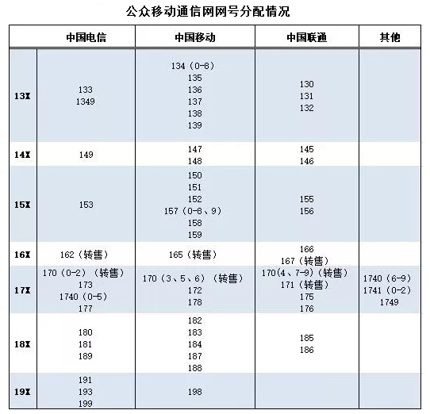
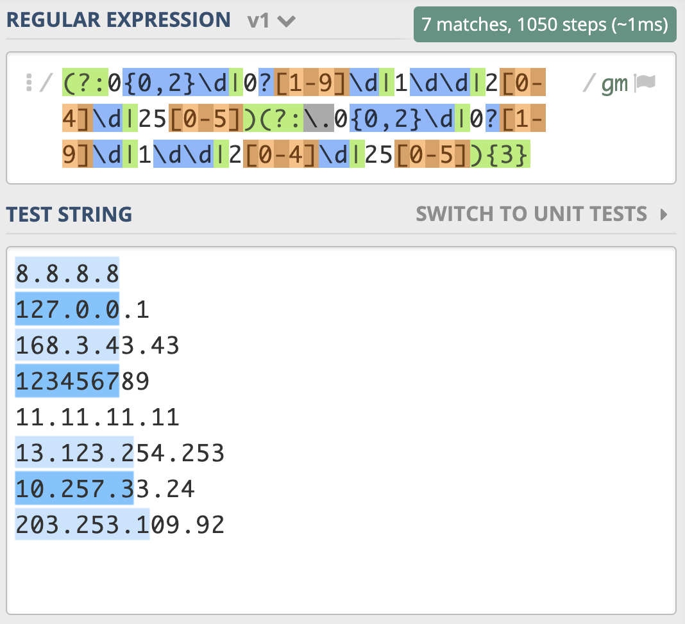
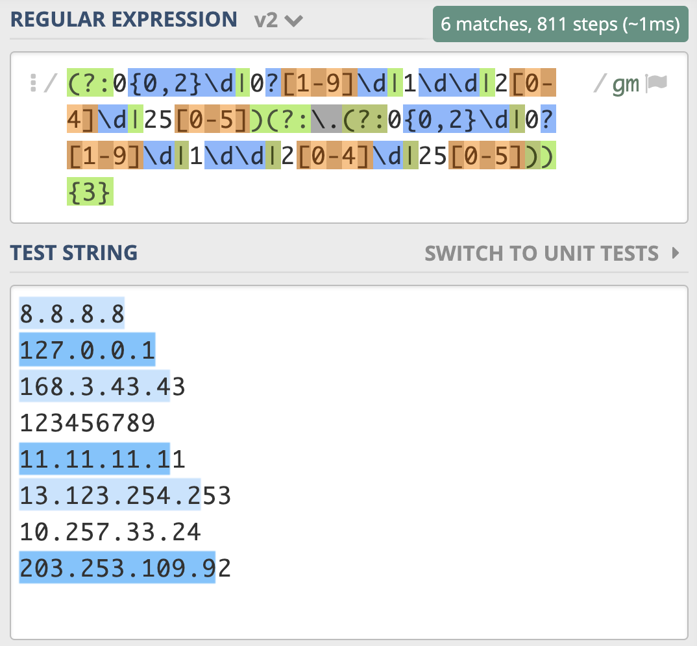
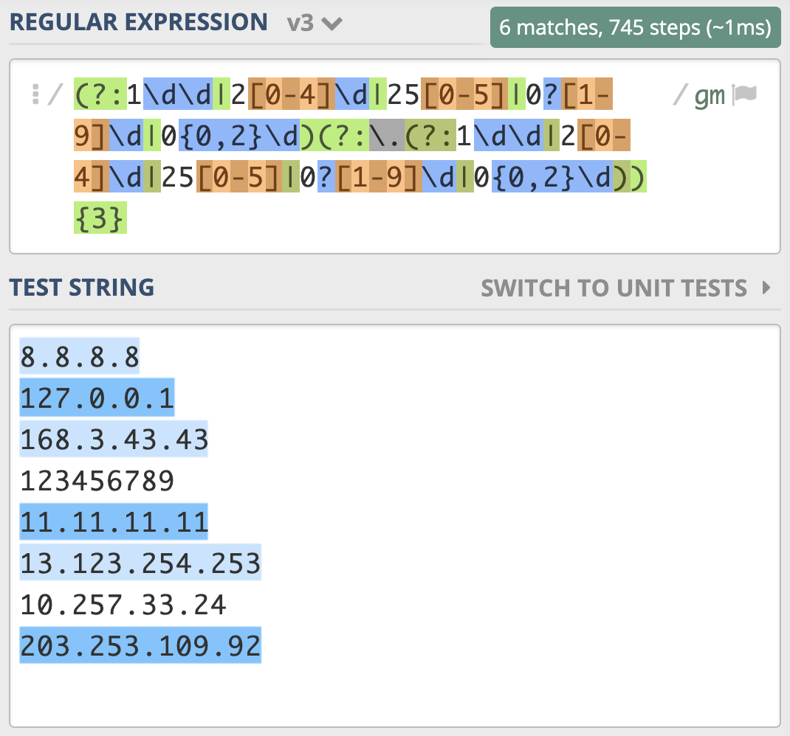
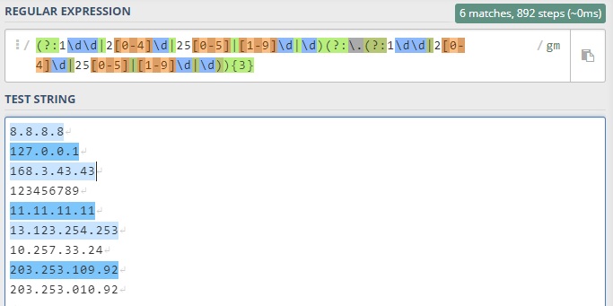
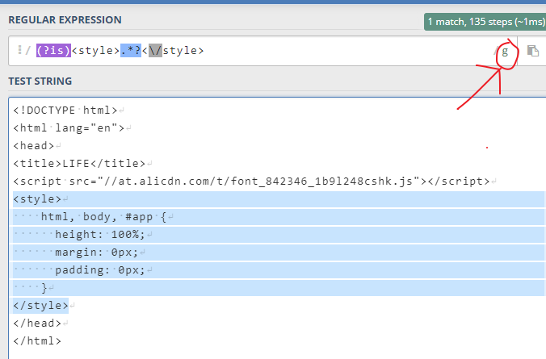

# 12丨问题集锦：详解正则常见问题及解决方案

今天我来给你讲一讲，使用正则处理一些常见问题的方法。

## 问题处理思路

在讲解具体的问题前，我先来说一下使用正则处理问题的基本思路。有一些方法比较固定，比如将问题分解成多个小问题，每个小问题见招拆招：

- 某个位置上可能有多个字符的话，就⽤字符组。
- 某个位置上有多个字符串的话，就⽤多选结构。
- 出现的次数不确定的话，就⽤量词。
- 对出现的位置有要求的话，就⽤锚点锁定位置。

在正则中比较难的是 **某些字符不能出现**，这个情况又可以进一步分为：

- 组成中不能出现，

- 要查找的内容前后不能出现

  这一种用环视来解决就可以了

我们主要说一下第一种。

如果是要查找的内容中 **不能出现某些字符**，这种情况比较简单，可以通过使用中括号来排除字符组，比如非元音字母可以使用 `[^aeiou]` 来表示。

如果是内容中 **不能出现某个子串**，比如要求密码是 6 位，**且不能有连续两个数字出现**。假设密码允许的范围是 `\w`，你应该可以想到使用  `\w{6}`  来表示 6 位密码，但如果里面不能有连续两个数字的话，该如何限制呢？这个可以环视来解决，就是每个字符的后面都不能是两个数字（要注意开头也不能是 `\d\d`），下面是使用 Python3 语言测试的示例。

```python
>>> import re
>>> re.match(r'^((?!\d\d)\w){6}$', '11abcd')  # 不能匹配上
# 提示 (?!\d\d) 代表右边不能是两个数字，但它左边没有正则，即为空字符串
>>> re.match(r'^((?!\d\d)\w){6}$', '1a2b3c')  # 能匹配上
<re.Match object; span=(0, 6), match='1a2b3c'>
>>> re.match(r'^(\w(?!\d\d)){6}$', '11abcd')  # 错误正则示范                                                                
<re.Match object; span=(0, 6), match='11abcd'>
```



在写完正则后，我们可以通过一些工具去调试，先要确保正则满足功能需求，再看一下有没有性能问题， 如果功能不正确，性能考虑再多其实也没用。

## 常见问题及解决方案

### 1. 匹配数字

数字的匹配比较简单，通过我们学习的 **字符组**，**量词等** 就可以轻松解决。

- 数字在正则中可以使用 `\d`  或 `[0-9]` 来表示。

- 如果是连续的多个数字，可以使用 `\d+` 或 `[0-9]+`。

- 如果 n 位数据，可以使用  `\d{n}`。

- 如果是至少 n 位数据，可以使用 `\d{n,}`。

- 如果是 m-n 位数字，可以使用 `\d{m,n}`。

### 2. 匹配正数、负数和小数

如果希望正则能匹配到比如 `3，3.14，-3.3，+2.7` 等数字，需要注意的是：

- 开头的正负符号可能有，也可能没有，所以可以使用  `[-+]?` 来表示

- 小数点和后面的内容也不一定会有，所以可以使用  `(?:\.\d+)?`  来表示

  分解问题的时候，要注意，像笔者就没有想到小数点和数字是一起的，有小数点必定有数字。

因此匹配正数、负数和小数的正则可以写成  `[-+]?\d+(?:\.\d+)?`。

测试文本如下

```
+3.14
3
3.0
+45
-34
-4.35
```


非负整数，包含 0 和 正整数，可以表示成 `[1-9]\d*|0`。

非正整数，包含 0 和 负整数，可以表示成 `-[1-9]\d*|0`。

这里直接是 `[1-9]\d*` 解释：

- `*`：0 到 多次
- `\d`：任意数字
- `[1-9]`：数字 1 到 9

那么含义就出来了，第一位数字不能是 0，且位数至少是 1 位数（因为后面是 0 到多次）

### 浮点数

这个问题你可能觉得比较简单，其中表示正负的符号和小数点可能有，也可能没有，直接用  `[-+]?\d+(?:\.\d+)?`  来表示。

如果我们考虑 `.5` 和 `+.5` 这样的写法，但一般不会有 `-.5` 这样的写法。正则又如何写呢？

我们可以把问题拆解，浮点数分为:

- 符号位
- 整数部分
- 小数点和小数部分

这些部分都有可能不存在，如果我们每个部分都加个问号，这样整个表达式可以匹配上空。

根据上面的提示：

- 负号的时候整数部分不能没有

- 而正数的时候，整数部分可以没有

所以正则你可以将正负两种情况拆开，使用多选结构写成  

```
-?\d+(?:\.\d+)?|\+?(?:\d+(?:\.\d+)?|\.\d+)
```

这个可以拆分成两个问题：

- 负数浮点数表示：`-\d+(?:\.\d+)?`

  

  从测试来看，负数浮点数更适合 `-\d+(?:\.\d+)+`，不然那个 `-5` 也被选择了

- 正数浮点数表示：`\+?(?:\d+(?:\.\d+)?|\.\d+)`

  

  是需要加收尾限制的，不然会把负数中的数字也匹配上

### 十六进制数

十六进制的数字除了有 0-9 之外，还会有 a-f（或 A-F） 代表 10 到 15 这 6 个数字，所以正则可以写成 

```
[0-9A-Fa-f]+
```

### 手机号码

手机号应该是比较常见的，手机号段比较复杂，如果要兼容所有的号段并不容易。目前来看，前四位是有一些限制，甚至 1740 和 1741 限制了前 5 位号段。

我们可以简单地使用 **字符组** 和 **多选分支**，来准确地匹配手机号段。

- 如果只限制前 2 位，可以表示成 `1[3-9]\d{9}`，

- 如果想再精确些，限制到前三位，比如使用

  ```
  1(?:3\d|4[5-9]|5[0-35-9]|6[2567]|7[0-8]|8\d|9[1389])\d{8}
  
  缩短核心则是：1(?:多选分支)\d{8}
  ```

- 如果想精确到 4 位，甚至 5 位，可以根据公开的号段信息自己来写一下，但要注意的是，越是精确，只要有新的号段，你就得改这个正则，维护起来会比较麻烦。另外，在实际运用的时候，你可能还要考虑一下有一些号码加了 `+86` 或 `0086` 之类的前缀的情况。

手机号段的正则写起来其实写起来并不难，但麻烦的是后期的维护成本比较高，我之前就遇到过这种情况，买了一个 188 的移动号码，有不少系统在这个号段开放了挺长时间之后，还认为这个号段不合法。

目前公开的手机号段



### 身份证号码

我国的身份证号码是分两代的：

- 第一代是 15 位，开头都不能是 0

  `[1-9]\d{14}`

- 第二代是 18 位，最后一位可以是 X（或 x），开头不能是 0，

  第二代比第一代多 3 位数据，可以使用量词 0 到 1 次，即写成

  ```
  [1-9]\d{14}(\d\d[0-9Xx])?。
  ```

这里不得不说下，思路的问题，笔者最开始想到的写法是这样的

```
^(?!0)([\d]{14}|[\d]{17}[Xx0-9])$

核心是：^(?!0)(一代|二代)$
使用了一个否定顺序环境，右边不能为 0，可以看到其实可以直接用字符组 [1-9] 来代替环视
```

### 邮政编码

邮编一般为 6 位数字，首位不是 0，比较简单，可以写成  `[1-9]\d{5}`

之前我们也提到过，6 位数字在其它情况下出现可能性也非常大，比如手机号的一部分，身份证号的一部分，所以如果是数据提取，一般需要添加断言，即写成  ：

```
(?<!\d)[1-9]\d{5}(?!\d)

否定逆 序邮编 否定顺序，也就是说号码的前面不能是数字，号码的后面也不能是数字。
```

### 腾讯 QQ 号码

目前 QQ 号不能以 0 开头，最长的有 10 位，最短的从 10000（5 位）开始。从规则上我们可以得知：

- 首位是 1-9

- 后面跟着是 4 到 9 位的数字

即可以使用 `[1-9][0-9]{4,9}` 来表示。

### 中文字符

中文属于多字节 Unicode 字符，之前我们讲过比如通过 Unicode 属性，但有一些语言是不支持这种属性的，可以通过另外一个办法，就是 **码值的范围**，中文的范围是 `4E00 - 9FFF` 之间，这样可以覆盖日常使用大多数情况。

不同的语言是表示方式有一些差异，比如：

- 在 Python，Java，JavaScript 中

  Unicode 可以写成 `\u` 码值 来表示，即匹配中文的正则可以写成 `[\u4E00-\u9FFF]`

- 如果在 PHP 中使

  Unicode 就需要写成 `\u{码值}` 的样式。

下面是在 Python3 语言中测试的示例，你可以参考一下。

```python
# 测试环境，Python3
>>> import re
>>> reg = re.compile(r'[\u4E00-\u9FFF]')
>>> reg.findall("和伟忠一起学正则regex")
['和', '伟', '忠', '一', '起', '学', '正', '则']
```

### IPv4 地址
IPv4 地址通常表示成 `27.86.1.226` 的样式：

- 4 个数字用点隔开
- 每一位范围是 0-255

比如从日志中提取出 IP，如果不要求那么精确，一般使用  `\d{1,3}(\.\d{1,3}){3}` 就够了，需要注意点号需要转义。


如果我们想更精确地匹配，可以针对一到三位数分别考虑：

- 一位数时可以表示成 `0{0,2}\d`

  这个感觉不是表示一位数的，实测过程中 `109`  中的 09 被选择了

  个人觉得一位数就是 `\d`

- 两位数时可以表示成 `0?[1-9]\d`

  这个也不是严格的 2 位数，当时 `010` 的时候，010 会被选中

  个人觉得两位数就是 `[1-9]\d`，范围是 `10 ~ 99`

- 三位数时可以表示成 `1\d\d|2[0-4]\d|25[0-5]`

  这个表示三位数的时候可选有 1xx、24x、最大 255

  

使用多选分支结构把他们写到一起，就是 `0{0,2}\d|0?[1-9]\d|1\d\d|2[0-4]\d|25[0-5]` 这样。

这是表示出了 IPv4 地址中的一位（正则假设是 X），我们可以把 IPv4 表示成 `X.X.X.X`，可以使用量词，写成 `(?:X.){3}X 或 X(?:.X){3}`，由于 X 本身比较复杂，里面有多选分支结构，所以需要把它加上括号，所以 IPv4 的正则应该可以写成

```
(?:0{0,2}\d|0?[1-9]\d|1\d\d|2[0-4]\d|25[0-5])(?:\.0{0,2}\d|0?[1-9]\d|1\d\d|2[0-4]\d|25[0-5]){3}
```

你以为这么写就对了么，如果你测试一下就发现，匹配行为很奇怪。



```
8.8.8.8
127.0.0.1
168.3.43.43
123456789
11.11.11.11
13.123.254.253
10.257.33.24
203.253.109.92
203.253.010.92
```

看到这个结果，你可能觉得太难了，不要担心，更不要放弃。其实我一开始也觉得这么写就可以了，我也需要测试，如果不符合预期，那就找到原因不断完善。

我们根据输出结果的表现，分析一下原因。原因主要有两点，都和多选分支结构有关系。我们想的是所有的一到三位数字前面都有一个点，重复三次，但 **点号** 和 `0{0,2}\d` 写到一起，意思是一位数字前面有点，两位和三位数前面没有点，所以需要使用括号把点挪出去，最终写成

```
(?:0{0,2}\d|0?[1-9]\d|1\d\d|2[0-4]\d|25[0-5])(?:\.(?:0{0,2}\d|0?[1-9]\d|1\d\d|2[0-4]\d|25[0-5])){3}
```

但经过测试，你会发现还是有问题，最后一个数字只匹配上了一位。



上一讲正则匹配原理中，我们讲解了 NFA 引擎在匹配多分支选择结构的时候，优先匹配最左边的，所以找到了一位数符合要求时，它就「急于」报告，并没有找出最长且符合要求的结果，这就要求我们在写多分支选择结构的时候，要把长的分支放左边，这样就可以解决问题了，即正则写成

```
(?:1\d\d|2[0-4]\d|25[0-5]|0?[1-9]\d|0{0,2}\d)(?:\.(?:1\d\d|2[0-4]\d|25[0-5]|0?[1-9]\d|0{0,2}\d)){3}
```



在这个案例里，我们通过一步步推导，得到最终的答案。其实是想让你明白，你在写正则的时候，需要以什么样的分析思路来思考，最终如何解决问题，复杂的正则也很难一下子写出来，需要写完之后进行测试，在发现不符合预期后，不断进行完善。

在这里我还是想说一下，**如果只是验证是不是合法的 IPv4 地址**，可以直接使用点号切割，验证一下是不是四个部分，每个部分是不是在 `0-255` 之间就可以了，比使用正则来校验要简单很多，而且不容易出错。总之正则不是解决问题的唯一方法，我们要在合适的时候使用它，而不是说能用正则的都要用正则来解决。

上面的过程是一个解决问题的思路，建议一定要去跟着走一次，下面是笔者的（由于前面觉得老师的几个里面可能有不准确的地方，从下面的过程走下来，结果是正确的）：

```bash
# 1、2、3 位数合在一起：用多选分支
\d|[1-9]\d|1\d\d|2[0-4]\d|25[0-5]

# 第一次匹配：最前面一个 3 位多选分支组合，后面每个组合出现 3 次
# 会发现只匹配了一部分，是由于 . 写在了第一个多选分支里面，后续的多选分支是没有 . 的
(?:\d|[1-9]\d|1\d\d|2[0-4]\d|25[0-5])(?:\.\d|[1-9]\d|1\d\d|2[0-4]\d|25[0-5]){3}

# 优化这个问题：将 . 拿出来，去拼接每个多选分支的结果
# 这个时候会发现：IP 地址中的第 4 部分，只匹配了其中一部分数字
# 原因是 NFA 引擎在匹配多分支选择结构的时候，优先匹配最左边的
(?:\d|[1-9]\d|1\d\d|2[0-4]\d|25[0-5])(?:\.(?:\d|[1-9]\d|1\d\d|2[0-4]\d|25[0-5])){3}

# 优化这个问题：将多选分支中 长的放在最左边
1\d\d|2[0-4]\d|25[0-5]|[1-9]\d|\d

# 优化 IP 匹配正则
(?:1\d\d|2[0-4]\d|25[0-5]|[1-9]\d|\d)(?:\.(?:1\d\d|2[0-4]\d|25[0-5]|[1-9]\d|\d)){3}
```

下面是截图



特意测试了下，在 win10 下面写入 `203.253.010.92` 保存之后，其中的 `010` 会被变成 `10` ，那么上述的正则应该是正确的

###  日期和时间

假设日期格式是 `yyyy-mm-dd`：

- 如果不那么严格，我们可以直接使用 `\d{4}-\d{2}-\d{2}`。

- 如果再精确一些，比如月份是 1-12，当为一位的时候，前面可能不带 0，可以写成 01 或 1

  - 月份使用正则，可以表示成  `1[0-2]|0?[1-9]`

    可能的值的为：11、12 和 x 或 0x , 其中 x 为 1-9

  - 日可能是 1-31，可以表示成 `[12]\d|3[01]|0?[1-9]`

    可能的值为：1x、2x 或 30、31 或 0x、x

    这里需要注意的是 `0?[1-9]` 应该放在多选分支的最后面，因为放最前面，匹配上一位数字的时候就停止了

 正确的正则应该是 `\d{4}-(?:1[0-2]|0?[1-9])-(?:[12]\d|3[01]|0?[1-9])`。

时间格式比如是 23:34，如果是 24 小时制：

- 小时是 0-23

- 分钟是 0-59

所以可以写成  `(?:2[0-3]|1\d|0?\d):(?:[1-5]\d|0?\d)`。12 小时制的也是类似的，你可以自己想一想怎么写。

另外，日期中月份还有大小月的问题，比如 2 月闰年可以是 29 日，使用正则没法验证日期是不是正确的。我们也不应该使用正则来完成所有事情，而是只使用正则来限制具体的格式，比如四位数字，两位数字之类的，提取到之后，使用日期时间相关的函数进行转换，如果失败就证明不是合法的日期时间。

### 邮箱

```
邮箱示例：

weizhong.tu2020@abc.com
12345@qq.com
12345@qq.com.net
```

邮箱的组成是比较复杂的，格式是 `用户名@主机名`，用户名部分通常可以有英文字母，数字，下划线，点等组成，但其中点不能在开头，也不能重复出现。根据 RFC5322 没有办法写出一个完美的正则，不过我们可以实现一些简体的版本，比如：

```
[a-zA-Z0-9_.+-]+@[a-zA-Z0-9-]+\.[a-zA-Z0-9-.]+
```

- 用户名部分：支持数字、字母、下划线、`.`、`+`、`-`
- 主机名部分：字母、数字、中横线、必须有一个 `.` 、后面的域名支持多级

日常使用应该也够了。

### 网页标签

- 配对出现的标签，比如 title

  一般网页标签不区分大小写，我们可以使用 ` (?i)<title>.*?</title>` 来进行匹配。

  里面有一个特殊符号，正确的应该是 `(?i)<title>.*?<\/title>`

- 在提取引号里面的内容时，可以使用 `[^"]+`

  感觉这个有问题，这个只能表示不能是 引号

- 方括号里面的内容时，可以使用 `[^>]+` 等方式。

  这个也是只能表示不能是 `>` 符号

我们通过一些常见的问题，逐步进行分析，讲解了正则表达式书写时的思路，和一些常见的错误。这些正则如果用于校验，还需要添加断言，比如 `\A` 和 `\z`（或 `\Z`），或 `^` 和 `$`。如果用于数据提取，还应当在首尾添加相应的断言。

上面说提取 title 里面的内容，只能匹配一行里面的，像下面这样就不行了

```html
<!DOCTYPE html>
<html lang="en">
<head>
<title>LIFE</title>
<script src="//at.alicdn.com/t/font_842346_1b9l248cshk.js"></script>
<style>
    html, body, #app {
      height: 100%;
      margin: 0px;
      padding: 0px;
    }
</style>
</head>
</html>
```

可以使用 `(?is)<style>.*?<\/style>` 匹配，注意下图箭头，那里是很多的匹配模式，如果出现了 m，那么前面你写 `(?s)` 也不会变成单行模式的。



## 总结

今天我们了解了下正则处理问题的基本思路，通常是将问题拆解成多个小问题，每个小问题见招拆招：某个位置上可能是多个单字符就⽤字符组，某个位置上可能是多个字符串就⽤多选结构，出现次数不确定就⽤量词，对出现的位置有要求就用断言。遇到问题，你遵循这些套路，写出正则其实并不难。

我们从一些日常的问题入手，详细地讲解了一些常见的案例，也讲解了可能会遇到的一些坑，比如在使用多选结构时要注意的问题，你在后续工作中要注意避开这些问题。

我在这里给你放了一张今天所讲内容的总结脑图。


## 课后思考

你可以根据今天我们学习 IPv4 的方法，来写一下 IPv6 的正则表达式么？说一下你的分析思路和最终的答案，建议自己动手测试一下写出的正则。

```
# IPv6 示例
ABCD:EF01:2345:6789:ABCD:EF01:2345:6789

# 这种表示法中，每个 X 的前导 0 是可以省略的，例如：
2001:0DB8:0000:0023:0008:0800:200C:417A

# 上面的 IPv6 地址，可以表示成下面这样
2001:DB8:0:23:8:800:200C:417A

备注：这里不考虑0位压缩表示
```

不考虑 0 位压缩的情况就比较简单了：

- 因为是一共 8 位，每一位是 4 个值，且是一个十六进制，用：`[A-Fa-f0-9]{1,4}` 表示每一位

```
[A-Fa-f0-9]{1,4}(?::(?:[A-Fa-f0-9]{1,4})){7}
```

测试文本

```
ABCD:EF01:2345:6789:ABCD:EF01:2345:6789
2001:0DB8:0000:0023:0008:0800:200C:417A
2001:DB8:0:23:8:800:200C:417A
0:0:0:0:0:0:0:1 
```

