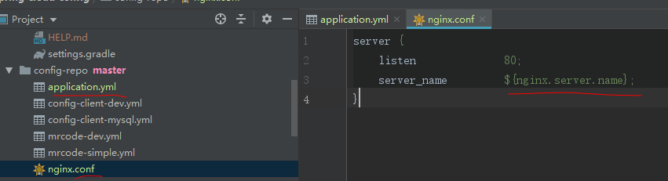
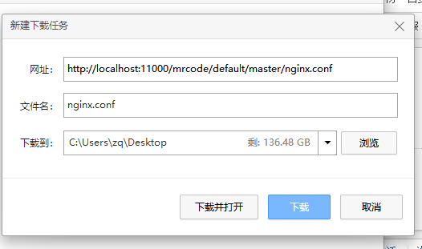

# 服务端输出格式支持

配置服务支持以下格式的输出配置文件，对于 spring boot 来说，json 格式是最方便的，因为能直接映射到 Environment 对象上，
而其他程序可以通过多种格式的支持找到自己满意的格式

- `.yml`
- `.json`
- `.yaml`
- `.properties`

比如以下地址都是访问同一个配置文件，只是返回的数据内容格式不一样

```
http://localhost:11000/mrcode-dev.json
http://localhost:11000/mrcode-dev.properties
```

YAML and properties 还支持 `${name}` 的占位符，

```yml
test2: 'xx ${name}' # 客户端上使用占位符，但是该 name 是在远程配置服务商的。
```

当使用 yaml 与 properties 来格式化内容的时候，有一些限制，主要与元数据的丢失有关。
例如，JSON 结构为一个有序的属性源列表，其名称与源相关。
yml 和 properties 被合并到一个映射中，即使值的原点有多个源，并且原始源文件的名称也会丢失。
此外，YAML 表示也不一定是支持存储库中 YAML 源的可靠表示。由一个平面属性源列表构成，必须对键的形式进行假设。

上面一段话，没有遇到过那里有问题，反正也说不明白，简单说，要格式化内容请使用 json 格式


## 纯文本支持

你可能需要针对某些纯文本配置进行定制，而不是使用 yml 来映射 Environment 对象，
`/{name}/{profile}/{label}/{path}` 这个断点提供了这样的功能。前面的与 Environment 含义一样，
最后一个 path 是一个具体的文件，如 log.xml，nginx.conf

下面是一个例子，提供一个纯文本的 nginx.config 配置文件，在该配置文件中通过 `${}` 占位符引用 yml 中的一些配置属性

如下图所示，在一个 git 仓库中包含 application.yml 和 nginx.conf

  

nginx.conf 文件中使用占位符应用了 环境配置文件中的 nginx.server.name 属性

```
server {
    listen              80;
    server_name         ${nginx.server.name};
}
```

application.yml 作为所有客户端共享的配置文件；下面文件中的 `---` 可以看成是使用分隔符分成了多个配置文件

- default profile: 第一段配置没有指定 spring.profiles ，那么默认就是 default
- development：第二段配置指定了 development

```yml
nginx:
  server:
    name: example.com
---
spring:
  profiles: development
nginx:
  server:
    name: develop.com
```

访问地址 `http://localhost:11000/mrcode/default/master/nginx.conf`  

```
server {
    listen              80;
    server_name         example.com;
}
```

::: tip tip

在浏览器中看到的文本可能只有一行，这是因为被浏览器自动格式化了，所以可以通过下载工具进行下载，比如 360 浏览器中的下载



下图是浏览器和下载后的文本内容对比


:::

访问地址 `http://localhost:11000/mrcode/development/master/nginx.conf`

```
server {
    listen              80;
    server_name         develop.com;
}
```

通过测试可以看到，配置服务支持输出占位符的纯文本，这就让配置服务中心更加的灵活了，可以给非 boot 应用提供配置服务

关于搜索路径，与 yml 一致，唯一的区别就是：不聚合所有匹配的资源，只返回第一个匹配的资源。

与用于环境配置的源文件一样，配置文件用于解析文件名。因此，如果您想要一个特定于 profile 的文件，
可以使用一个名为 `logback-development.xml` 的文件解析 `/*/development/*/logback.xml` (而不是 logback.xml)。

如同时存在以下两个文件，访问地址 `http://localhost:11000/mrcode/development/master/nginx.conf`，将匹配 nginx-development.conf

```
nginx.conf
nginx-development.conf
```
